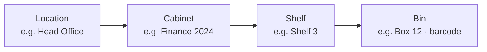

import { Callout, Steps } from 'nextra/components';

# Filing Structure

**Settings → Documents → Filing Structure** defines where records live. It mirrors physical
storage, so the same structure serves a scanned document and the paper original.

## The hierarchy



Four levels, each belonging to the one above:

| Level | Typically |
|---|---|
| **Location** | A building or site |
| **Cabinet** | A physical cabinet, or a broad category |
| **Shelf** | A shelf within it |
| **Bin** | A box or folder — **can carry a barcode** |

A bin's barcode is the useful part: it is what lets someone scan a box rather than read a
label, and what makes a [retrieval request](/dms/retrievals) unambiguous.

<Callout type="info">
  You do not have to use all four levels for digital-only records. The structure exists so
  that physical records can be located precisely; a purely digital filing plan can use
  Location and Cabinet alone.
</Callout>

## Setting it up

<Steps>
### Add a location

**Add Location**, then name it. Start with one — you can add sites later.

### Add cabinets, shelves and bins

Work downward. Each level is added within its parent.

### Put barcodes on bins that hold paper

If a bin exists physically, label it and record the barcode here. Barcodes are unique
across the system, so a scan resolves to exactly one bin.
</Steps>

## Naming — a suggestion, not a rule

The structure does not enforce a naming convention. A convention that has held up well
elsewhere:

```
Location   Head Office
Cabinet    Finance — Accounts Payable
Shelf      2024
Bin        2024-Q1 (barcode AP2024Q1)
```

Putting the period in the shelf or bin rather than the cabinet means a cabinet does not
have to be renamed each year, and retention reviews line up with whole bins — which
matters when a disposal decision covers a box rather than individual sheets.

<Callout type="warning">
  Think about this before the [bulk upload](/dms/bulk-upload). Re-filing a few hundred
  imported documents because the structure was wrong is the single most avoidable piece of
  work in setting up a DMS.
</Callout>

## Filing rules

Filing rules let a document be routed automatically based on its properties rather than
filed by hand. Where you have a predictable intake — a monthly bank statement, a supplier
invoice — a rule saves the filing step entirely.

## Document types, classifications and tags

Separate from the physical structure, three things describe *what* a document is:

| | Purpose |
|---|---|
| **Document type** | What kind of record it is — invoice, contract, certificate |
| **Classification** | Your filing scheme's category |
| **Tags** | Free-form labels, several per document |

Type and classification are the ones worth planning, because **retention schedules attach
to them**. See [Compliance Templates](/dms/compliance).
