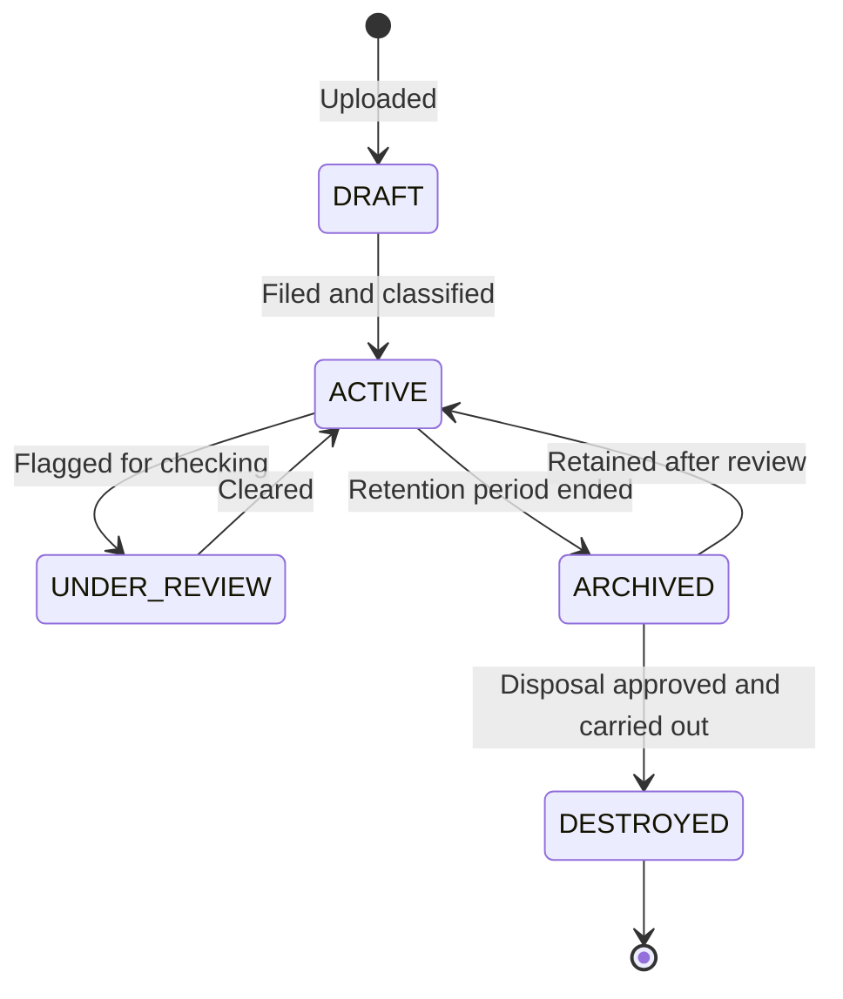

import { Callout } from 'nextra/components';

# Doc Manager

Doc Manager is the records management module. Where E-Sign is about getting a document
signed, Doc Manager is about **keeping** it: where it is filed, who may see it, how long
it must be kept, and proving all of that later.

It handles **physical documents as well as digital ones**. A record can be `DIGITAL`,
`PHYSICAL`, or `BOTH` — so a scanned contract can point at the shelf and bin where the
wet-ink original actually sits.

<Callout type="warning">
  **These pages were written from the system's data model and screens, not from a
  walkthrough of how your team uses it.** The structures, statuses and options described
  are accurate. Where a page suggests *practice* — who should approve a disposal, how long
  to keep something — that is marked as a suggestion, and your records policy wins.
</Callout>

## Which page do I need?

| I want to… | Go to |
|---|---|
| Set up where documents live | [Filing Structure](/dms/filing) |
| Control who can see what | [Permissions & Confidentiality](/dms/permissions) |
| Reuse a retention schedule | [Compliance Templates](/dms/compliance) |
| File a single document | [Filing a Document](/dms/documents) |
| Import a backlog | [Bulk Upload](/dms/bulk-upload) |
| Find something | [Search & Favourites](/dms/search) |
| Get a physical file out of storage | [Retrieval Requests](/dms/retrievals) |
| Deal with documents past their keep-until date | [Retention & Disposal](/dms/retention) |
| Check OCR progress, or ask questions of documents | [OCR Queue & AI](/dms/ocr-ai) |
| Prove who did what | [Activity & Audit](/dms/activity) |

## How a record moves

Alongside that, a separate **disposal** status tracks the retention decision:
`NOT_DUE` → `DUE_FOR_REVIEW` → `APPROVED_FOR_DISPOSAL` → `DISPOSED`, or `RETAINED` if
the review decides to keep it.

Two statuses rather than one is deliberate: *where the record is in its life* and *what
was decided about destroying it* are different questions, and auditors ask them
separately.

## Suggested order to set things up

1. **[Filing Structure](/dms/filing)** — you cannot file anything without somewhere to
   put it
2. **[Permissions](/dms/permissions)** — before real documents go in, not after
3. **[Compliance Templates](/dms/compliance)** — so retention is applied consistently
   from the first document
4. **[Bulk Upload](/dms/bulk-upload)** — bring in the backlog once the above are settled

Getting permissions and retention in place before the documents arrive saves
reclassifying everything later.
