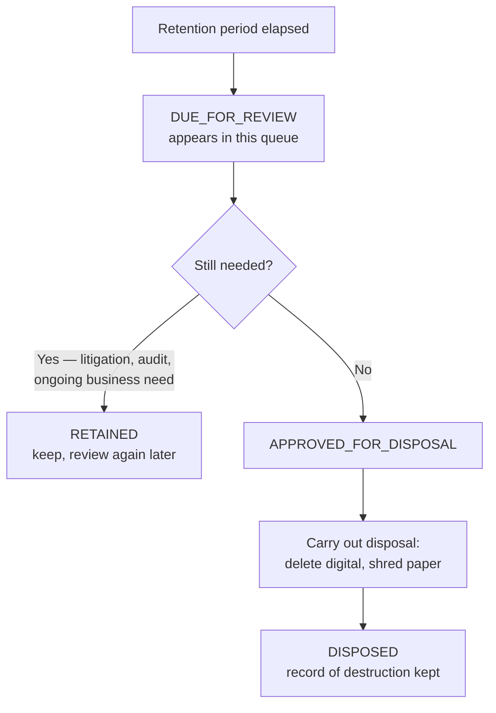

import { Callout } from 'nextra/components';

# Retention & Disposal

**Settings → Documents → Retention** lists documents that have reached their retention date and
require a decision.

<Callout type="warning">
  This is the one page in Doc Manager where a mistake is **not recoverable**. A record marked
  `DESTROYED` and disposed of is gone. Read this page before working the queue.
</Callout>

## How a document gets here

A retention period comes from the [compliance template](/dms/compliance) attached to the
document's type. When that period elapses, the document's disposal status moves from
`NOT_DUE` to `DUE_FOR_REVIEW` and it appears in this queue.

Nothing is destroyed automatically. Arriving here is a prompt for a human decision, not an
instruction.

## The decision

| Status | Means |
|---|---|
| `NOT_DUE` | Retention period still running |
| `DUE_FOR_REVIEW` | Elapsed, awaiting a decision |
| `APPROVED_FOR_DISPOSAL` | Decision made, not yet carried out |
| `DISPOSED` | Destroyed |
| `RETAINED` | Reviewed and kept |

`APPROVED_FOR_DISPOSAL` being separate from `DISPOSED` is deliberate. Approving destruction
and carrying it out are different acts, often by different people, and for physical records
days apart. The gap is where a mistake can still be caught.

## Before approving any disposal

Four questions, in order:

1. **Is there live or anticipated litigation, audit or investigation touching this?** If so,
   stop. A legal hold overrides a retention schedule, and destroying records under hold is a
   serious matter.
2. **Is the retention period right?** Check the period was measured from the correct event —
   contract end, not filing date. See [Compliance Templates](/dms/compliance).
3. **Is this the only copy?** A `BOTH` record means paper exists too. Disposing of the digital
   record does not shred the box.
4. **Who authorised it?** Record it. *Why* something was destroyed is the question asked
   later, and the [audit trail](/dms/activity) is where the answer has to be.

<Callout type="info">
  When in doubt, `RETAINED` is the safe answer. A record kept too long is a storage cost. A
  record destroyed too early can be unrecoverable evidence.
</Callout>

## Physical disposal

For `PHYSICAL` and `BOTH` records, marking `DISPOSED` in HubSign does not destroy anything —
it records that destruction was decided. Someone still has to retrieve the box and shred it.

Keep those in step. A system saying a document was destroyed while the paper sits in a bin is
worse than either state alone: an auditor is told it is gone, and then someone finds it.

## Suggested practice

- Work the queue on a **schedule** — monthly or quarterly — rather than when it grows
  alarming. Batching keeps decisions consistent.
- Separate **who approves disposal** from who can `DELETE` records day to day. See
  [Permissions](/dms/permissions).
- Dispose **by bin** where you can, so a physical trip destroys a whole box rather than
  extracting sheets.
- Keep the disposal record. `DISPOSED` documents remain as evidence that destruction was
  authorised and carried out properly — which is the point.
