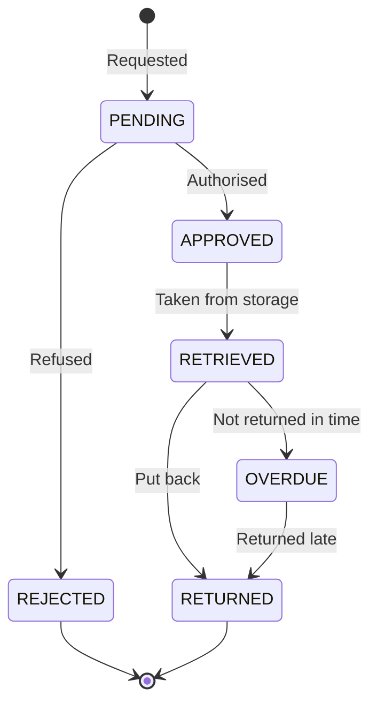

import { Callout } from 'nextra/components';

# Retrieval Requests

**Doc Manager → Retrievals** tracks requests to fetch **physical** documents from their
filing locations — and, importantly, whether they came back.

## Where a request starts

Requests are created **from the document detail page** of a physical record, not from this
page. This page is the tracking queue.

That is the right way round: you request the document you are looking at, so the request
already knows which bin to go to.

## The states

| State | Means |
|---|---|
| `PENDING` | Requested, awaiting a decision |
| `APPROVED` | Authorised, not yet collected |
| `REJECTED` | Refused |
| `RETRIEVED` | Out of storage and in someone's hands |
| `RETURNED` | Back in its bin |
| `OVERDUE` | Out longer than allowed |

## Why `OVERDUE` matters more than it looks

A physical record that is out of its bin and unaccounted for is the failure mode of every
paper archive. Someone pulls a contract for a meeting, the meeting ends, and the file sits
in a drawer for two years — until an audit asks for it and the shelf is empty.

`OVERDUE` exists to make that visible while it is still recoverable. It is worth someone
owning this queue and chasing it, in the same way a library does.

<Callout type="warning">
  A `RETRIEVED` request that is never marked `RETURNED` leaves the system believing a
  document is out when it may be back on the shelf. Closing the loop matters as much as
  opening it — otherwise the queue fills with noise and stops being read.
</Callout>

## Workflow integration

Creating a request fires `DMS_RETRIEVAL_REQUESTED`, so a
[workflow](/organization/workflows) can notify the records team, post to a Teams channel, or
email whoever holds the keys — rather than relying on someone watching this page.

That is worth setting up. A request queue nobody is notified about is a request queue nobody
services.

## A suggested practice

- Require **approval** for anything `CONFIDENTIAL` or `RESTRICTED`; let ordinary records be
  approved routinely
- Set an expected return period and mean it — the `OVERDUE` state is only useful if it is
  acted on
- When a document is retrieved often, ask whether it should be scanned to `BOTH` so the next
  request is a download rather than a trip to the shelf

The third point is the one that reduces this queue over time.
