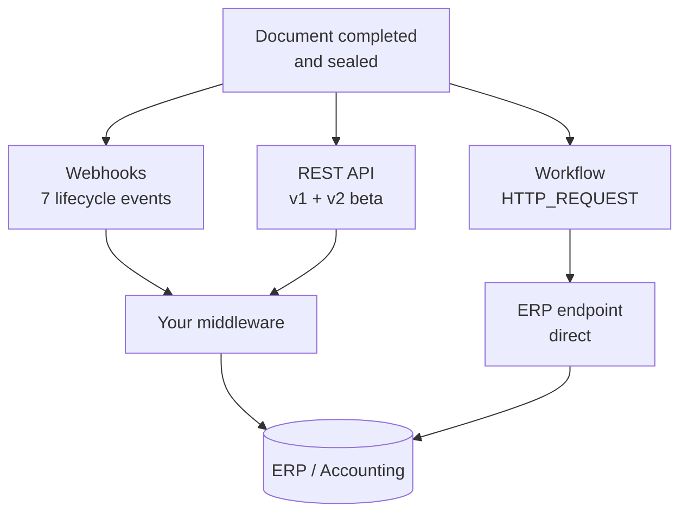
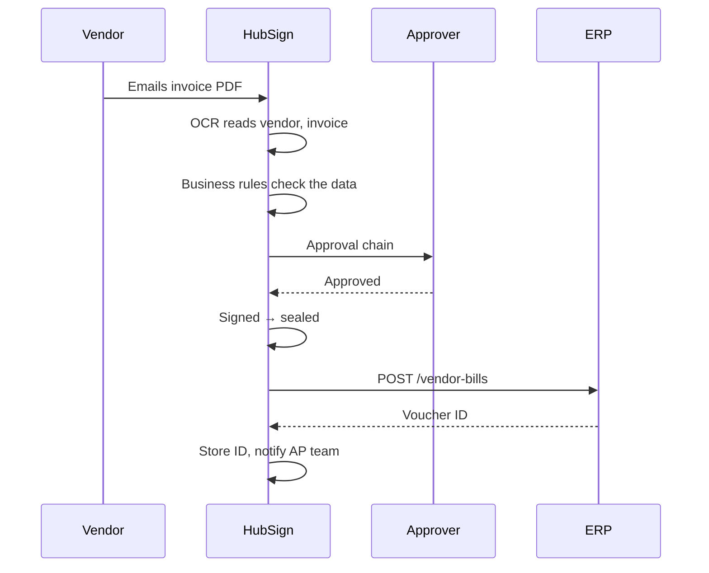

import { Callout, Steps } from 'nextra/components';

# ERP & Accounting Integration

A signed invoice is an event your finance system should know about. HubSign has three
outbound mechanisms, all working today.



## The three surfaces

### Webhooks — push, no polling

Subscribe to any of seven events: `DOCUMENT_CREATED`, `DOCUMENT_SENT`,
`DOCUMENT_OPENED`, `DOCUMENT_SIGNED`, `DOCUMENT_COMPLETED`, `DOCUMENT_REJECTED`,
`DOCUMENT_CANCELLED`.

`DOCUMENT_COMPLETED` fires **after** the document is sealed, so by the time your
endpoint is called the final PDF exists and can be fetched. This is the natural trigger
for posting to an ERP.

### REST API — pull and push

Authenticate with an API token.

| Purpose | Endpoint |
|---|---|
| List documents | `GET /api/v1/documents` |
| Get one document | `GET /api/v1/documents/:id` |
| **Download the signed PDF** | `GET /api/v1/documents/:id/download` |
| Create from a template | `POST /api/v1/templates/:templateId/create-document` |
| Send for signature | `POST /api/v1/documents/:id/send` |

### Workflow `HTTP_REQUEST` — no service to deploy

A [workflow](/organization/workflows) calls your ERP directly, with the body templated
from the run. Lowest-effort route by a wide margin.

<Callout type="warning">
  Workflows cannot yet trigger on eSign events — `DOCUMENT_COMPLETED` and its siblings
  are selectable in the builder but nothing dispatches them. For completion-driven
  posting today, use a **webhook**. `HTTP_REQUEST` works well when driven by
  `INBOX_OCR_COMPLETED`.
</Callout>

## Pattern: accounts payable posting



The extracted fields are already an AP posting payload — vendor, invoice number, PO
number, dates, currency, subtotal, tax, total — so nothing is re-keyed.

```json
{
  "type": "ACTION",
  "config": {
    "action": "HTTP_REQUEST",
    "method": "POST",
    "url": "https://erp.example.com/api/ap/vendor-bills",
    "headers": {
      "Authorization": "Bearer {{ vars.erpToken }}",
      "Idempotency-Key": "hubsign-doc-{{ document.id }}"
    },
    "body": {
      "vendorName": "{{ ocr.vendor_name }}",
      "invoiceNumber": "{{ ocr.invoice_number }}",
      "poNumber": "{{ ocr.po_number }}",
      "invoiceDate": "{{ ocr.invoice_date }}",
      "dueDate": "{{ ocr.due_date }}",
      "currency": "{{ ocr.currency }}",
      "subtotal": "{{ ocr.subtotal }}",
      "taxAmount": "{{ ocr.tax_amount }}",
      "totalAmount": "{{ ocr.total_amount }}",
      "signedAt": "{{ document.completedAt }}"
    },
    "saveResponseAs": "erpBill"
  }
}
```

<Callout type="warning">
  **Always send an idempotency key.** Retries and re-runs happen. Keying on the HubSign
  document ID lets the ERP recognise a duplicate instead of creating a second liability.
</Callout>

## Pattern: three-way match

Fetch the PO from the ERP into a workflow variable, then let a
[business rule](/organization/business-rules) block the signature on a discrepancy —
so a mismatch never reaches the ledger, and the signer is told which figure disagrees.

## Pattern: archival

On completion, fetch `GET /api/v1/documents/:id/download` and attach the PDF to the ERP
record, to [Doc Manager](/dms), or both.

Two deliberate decisions: attach the **full sealed PDF including the audit certificate**
as the evidentiary copy, and decide which system auditors will actually be pointed at.

## Reaching your ERP from the cloud

HubSign runs in WorkHub Cloud. Every webhook and every `HTTP_REQUEST` leaves from
there, not from inside your network, so `https://erp.internal/...` will not resolve.

| Option | What it means |
|---|---|
| **Public HTTPS endpoint** | Expose a narrow, authenticated integration endpoint, restricted to WorkHub Cloud's egress addresses — ask your provider for the list |
| **Reverse tunnel or VPN** | Terminate a tunnel at a publicly reachable host and forward inward |
| **Pull instead of push** | Leave the ERP closed; middleware inside your network polls `GET /api/v1/documents`. Slower, but nothing inbound is opened |

The pull option deserves serious consideration if opening anything to your finance
system is contentious. A stored watermark plus that one endpoint is enough.

## Choosing an approach

| | Workflow `HTTP_REQUEST` | Webhook + middleware | API polling |
|---|---|---|---|
| **Effort** | Configuration only | A service to deploy | A service to deploy |
| **Latency** | Immediate | Immediate | Poll interval |
| **Field mapping** | Templating only | Anything | Anything |
| **Retry / dead-letter** | No | Yours to build | Yours to build |
| **Best for** | One ERP, simple mapping | Several systems, real mapping, guaranteed delivery | Reconciliation, backfill |

Start with `HTTP_REQUEST` — it proves the mapping in an afternoon. Move to
webhook-plus-middleware when you need guaranteed delivery or several destinations.

## Before you go live

<Steps>
### Make every write idempotent

Send the document ID as an idempotency key.

### Never post unreviewed OCR figures

Extraction is a guess. The review step in the [Signature
Inbox](/organization/signature-inbox) exists for this, and `ocr.confidence` exists so a
rule can insist on it. A misread total posts a wrong liability silently.

### Keep credentials out of step bodies

Store them as workflow variables, not inline where anyone with workflow access can read
them.

### Reconcile on a schedule

A `SCHEDULE` workflow can compare completed documents against posted transactions and
notify on drift.
</Steps>
