# HubSign — User Manual

**Organization administration, e-signature, and downstream integration**

Version 2.3.1 · Last updated 2026-08-12

---

## Contents

1. [What HubSign is](#1-what-hubsign-is)
2. [Roles and access](#2-roles-and-access)
   - [2.1 Finding your way around](#21-finding-your-way-around)
3. [Part I — E-Signature](#part-i--e-signature)
   - [3.1 The signing lifecycle](#31-the-signing-lifecycle)
   - [3.2 Preparing a document](#32-preparing-a-document)
   - [3.3 Recipients, roles and signing order](#33-recipients-roles-and-signing-order)
   - [3.4 What the signer sees](#34-what-the-signer-sees)
   - [3.5 Supporting documents](#35-supporting-documents)
   - [3.6 Completion, the audit certificate, and downloads](#36-completion-the-audit-certificate-and-downloads)
   - [3.7 Rejecting, resending, cancelling](#37-rejecting-resending-cancelling)
   - [3.8 Templates and document merging](#38-templates-and-document-merging)
4. [Part II — Organization](#part-ii--organization)
   - [4.1 Dashboard](#41-dashboard)
   - [4.2 Settings](#42-settings)
   - [4.3 Members, domains and seats](#43-members-domains-and-seats)
   - [4.4 Signature Inbox (email-to-sign + OCR)](#44-signature-inbox-email-to-sign--ocr)
   - [4.5 Business Rules](#45-business-rules)
   - [4.6 Approvals](#46-approvals)
   - [4.7 Workflows](#47-workflows)
   - [4.8 Email Templates](#48-email-templates)
   - [4.9 Stamps, Metadata, Doc Manager](#49-stamps-metadata-doc-manager)
   - [4.10 Integrations (Microsoft Teams)](#410-integrations-microsoft-teams)
   - [4.11 Billing and Recycle Bin](#411-billing-and-recycle-bin)
5. [Part III — Integrating with ERP and accounting systems](#part-iii--integrating-with-erp-and-accounting-systems)
6. [Appendix A — Event reference](#appendix-a--event-reference)
7. [Appendix B — Known gaps](#appendix-b--known-gaps)

---

## 1. What HubSign is

HubSign is an electronic signature platform delivered as a cloud service on
**WorkHub Cloud**. A document is uploaded or received by email, fields are placed
on it, recipients sign it in the browser, and the result is a sealed,
cryptographically signed PDF with an audit trail.

Around that core it adds an organization layer: invoice intake by email with OCR
extraction, approval chains, a business rule engine that can refuse a signature,
a workflow engine, and a document management module.

There is nothing for you to install or run. Your organization is provisioned as a
tenant, and two consoles are involved:

| | Where | What it is for |
|---|---|---|
| **HubSign** | your HubSign address | Everything in this manual — documents, signing, organization settings |
| **WorkHub console** | `console.workhubplatform.io` | Tenant-level provisioning: subscription and seats, mailboxes for email intake, domains, users and SSO |

Most of the time you only need HubSign. The WorkHub console appears in this manual
where a task depends on tenant provisioning — buying seats, or creating the
mailbox the Signature Inbox reads from.

Three ideas are worth understanding before anything else, because most of the
platform's behaviour follows from them:

**Sealing is one-way.** When the last recipient signs, the PDF is flattened,
the audit certificate is appended, and the file is digitally signed. Everything
that affects the finished document — stamps, the certificate, field placement —
is decided at that moment and cannot be changed afterwards.

**The organization is the tenant.** Documents, rules, workflows and members
belong to an organization. Almost everything you will want to configure is in
**Settings**, which is organization-wide; your own profile, password and
notification preferences are somewhere else entirely, under your avatar.

**HubSign reaches out from the cloud, not from your office.** Anything HubSign
calls — an ERP endpoint, a Teams webhook — is called from WorkHub Cloud. A system
that is only reachable inside your own network cannot be reached this way. This
matters for integrations; see [5.6](#56-before-you-go-live).

---

## 2. Roles and access

| Role | Scope | Can do |
|---|---|---|
| **Org Admin** | Organization | Everything below, plus settings, members, billing, rules, workflows, approvals, integrations |
| **Org Manager** | Organization | Day-to-day document work; some integration settings |
| **Org Member** | Organization | Create, send and sign documents; sees only their own work |
| **Platform operator** | WorkHub Cloud | Tenant provisioning and support actions. Held by your service provider, not by your organization |

Administrative screens are withheld from ordinary members in two places: the
sidebar hides the link, **and** the route itself refuses to render. Hiding a nav
item alone would leave the URL reachable by typing it.

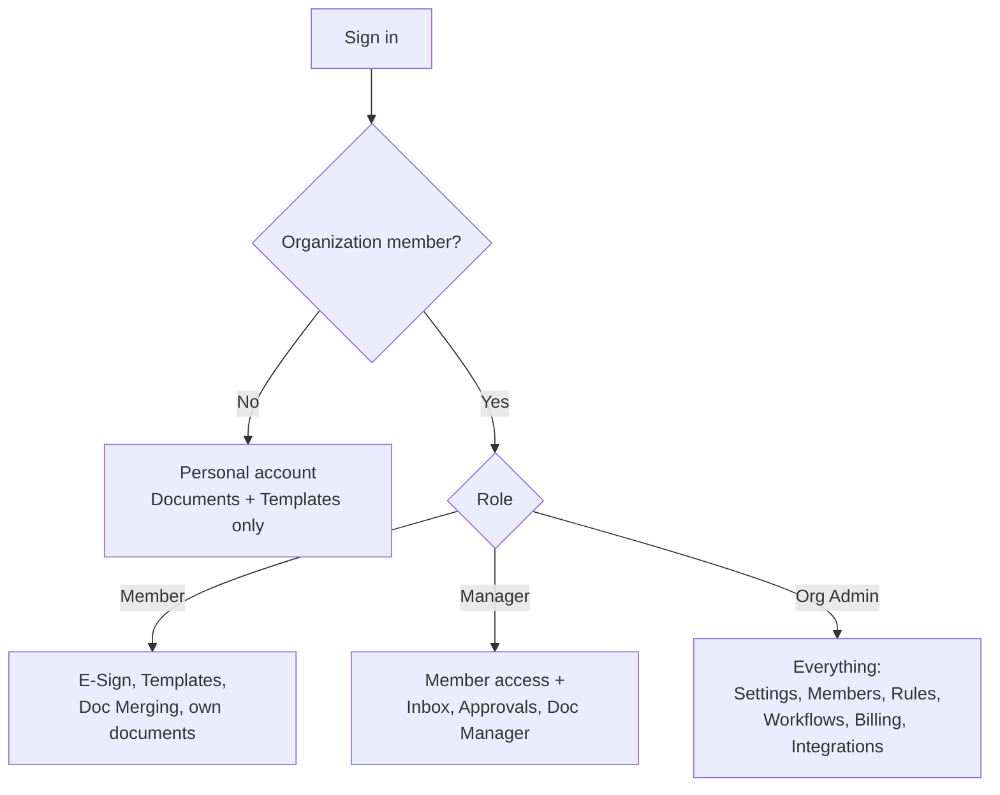

---

## 2.1 Finding your way around

Three levels, and knowing which level a screen belongs to is usually enough to
find it: the **sidebar** for daily work, **tabs** for views over the same thing,
and **Settings** for configuration you set once.

| Sidebar row | What it is | Tabs inside it |
|---|---|---|
| **Home** | Live signing activity for the organization | Overview · SLA · Activity |
| **Inbox** | Invoices emailed in, waiting to be sent for signature | Incoming |
| **E-Sign** | Documents going through signing — drafts, out for signature, completed | — |
| **Repository** | The records library (Doc Manager) | Overview · Browse · Processing · Search · Favorites · Trash |
| **Templates** | Reusable documents with fields already placed | — |
| **Tasks** | Everything waiting on you | Approvals · Workflow Steps · Retrievals |
| **Tools** | Utilities you run rather than places you go | Merge · Bulk Upload · Exports · AI Agent |
| **Settings** | Organization configuration | see below |
| **Admin** | Platform administration, for HubSign operators | — |

**Inbox** means the *signature* inbox — invoices vendors emailed you, read by OCR,
waiting for someone to send them for signature. It is not **Repository →
Processing**, which reports OCR progress on the records library.

Settings is a page of its own with four categories. The category holding the page
you are on opens by itself, and a collapsed category with a dot beside it is the
one you are currently in.

| Settings category | Screens |
|---|---|
| **Organization** | Profile & Branding · Members & Roles · Teams · Billing & Plan · Integrations |
| **Documents** | Filing Structure · Metadata Fields · Retention · Stamps · Access Control · Compliance · Repository Options |
| **Automation** | Workflows · Business Rules · Approval Templates · Approver Roles & Rules · Email Templates |
| **Developer** | API Tokens · Webhooks |

The categories name **the thing being configured**, not the module that implements
it — which is why retention and the filing structure sit beside stamps and
metadata. Your own settings (profile, password, notifications, personal billing)
are under your avatar, kept deliberately apart from the organization's.

A per-screen lookup table lives on the [Navigation](/navigation) page.

---

# Part I — E-Signature

## 3.1 The signing lifecycle

Every document moves through the same five states.

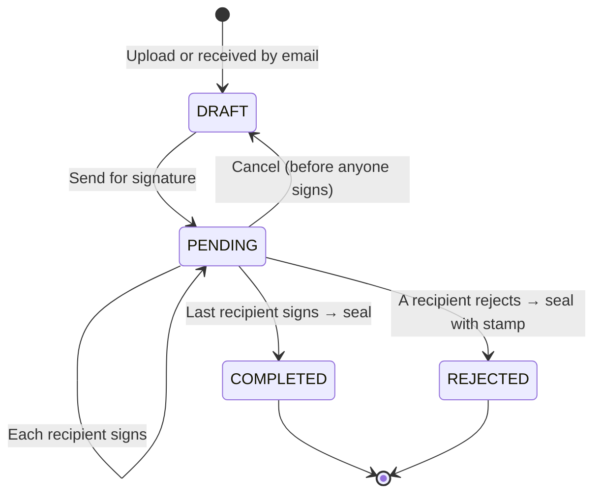

`COMPLETED` and `REJECTED` are terminal. Both produce a sealed PDF; a rejection
additionally stamps the reason onto the document.

## 3.2 Preparing a document

1. **E-Sign → Upload** — drop in a PDF.
2. **Add recipients** — name, email, and a role each (below).
3. **Place fields** — drag onto the page and assign each to a recipient.
4. **Settings** — subject, message, signing order, optional PDF password.
5. **Send** — recipients receive an email with a unique signing link.

### Field types

| Field | Signer does | Notes |
|---|---|---|
| **Signature** | Draws, types or uploads a signature | The legally operative mark |
| **Initials** | Draws initials | |
| **Name** | Confirms full name | Pre-filled from the recipient |
| **Email** | Confirms email | |
| **Date** | Auto-stamped at signing | |
| **Text** | Types free text | Can be required, with length limits |
| **Number** | Types a number | Min/max validation |
| **Checkbox** | Ticks one or more | Can require a minimum |
| **Radio** | Picks one option | |
| **Dropdown** | Selects from a list | |

Required fields block completion. A signer cannot finish until every required
field assigned to them is filled — the Complete button stays as "Next field"
and jumps them to what is outstanding.

## 3.3 Recipients, roles and signing order

| Role | Meaning |
|---|---|
| **Signer** | Fills fields and signs |
| **Approver** | Approves without signature fields |
| **Viewer** | Must open the document; adds no marks |
| **CC** | Receives the finished copy only |
| **Assistant** | Fills fields *on behalf of* another recipient, who then signs |

**Signing order** is either parallel (everyone at once) or **sequential** — each
recipient's link only becomes active when the previous one finishes. With
sequential order enabled you can also allow a signer to **dictate the next
signer**, entering their name and email at the moment they sign.

## 3.4 What the signer sees

The signer needs no account. They open the emailed link and get the document on
the left, and a signing panel on the right containing their full name, a
signature pad, an optional supporting-document uploader, and Complete.

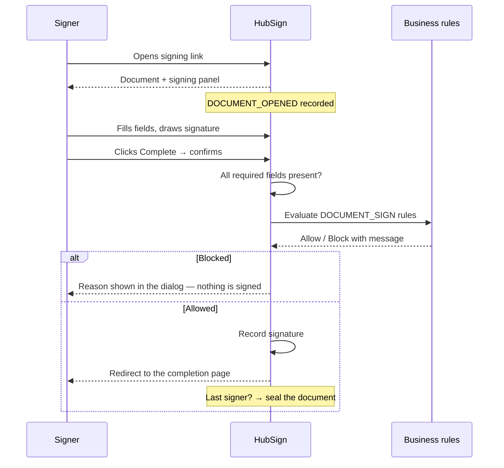

If a business rule refuses the signature, the reason written by your
organization appears in the confirmation dialog and nothing is recorded.
Retrying without changing anything is refused identically.

## 3.5 Supporting documents

A signer can attach their own files above the signature — a purchase order, a
spec sheet, a photo.

- **Allowed:** PDF, Word, Excel, images, CSV
- **Blocked:** executables and archives, rejected by extension, MIME type **and**
  magic bytes, so renaming a file does not get it through
- **Limits:** 15 MB per file, 10 files per recipient
- **Storage:** the same object store as the document, linked to the signing request

Attachments upload immediately, so they survive an abandoned signing session.
They appear in the document's download section afterwards and are downloaded
one at a time.

## 3.6 Completion, the audit certificate, and downloads

When the last recipient signs, HubSign seals the document:

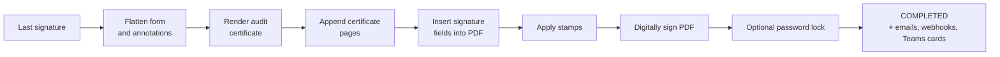

### The audit certificate

The **Final Audit Report** is appended as extra page(s) recording who signed,
when, from where, and the document's integrity hash. It is your evidence that
the signature happened.

**It is added at seal time and cannot be added or removed afterwards.**

### Choosing whether to include it

**Settings → Organization → Profile & Branding**, *Signed Documents* card controls whether new documents
get the certificate. This is the right switch if your documents are circulated
externally and the extra page is unwanted. It applies to documents completed
from that point on.

For documents already signed, use the **Download** split-button on the document
page:

- **Download** — the full signed record, certificate included
- **Download without audit certificate** — the signed pages only, for internal use

The same choice appears in the ⋯ menu and the documents-table row menu, along
with print equivalents.

> **Why both?** The certificate is baked into the sealed PDF, so a setting cannot
> retroactively strip it. The download option removes the trailing certificate
> pages from the copy you receive; the sealed original is untouched.

Documents that were password-locked at seal time cannot offer the strip option —
the file cannot be opened to count its pages, so they show a plain Download
button.

## 3.7 Rejecting, resending, cancelling

- **Reject** — a recipient declines with a reason. The document is sealed with a
  rejection stamp and the reason recorded. Terminal.
- **Resend** — re-send the invitation email to recipients who have not signed.
- **Cancel** — withdraw a document that is out for signature.
- **Recycle Bin** — deleted documents are recoverable from
  **Repository → Trash** before permanent deletion.

## 3.8 Templates and document merging

**Sign Templates** — save a document's recipients and field layout as a reusable
template. Creating a document from a template pre-places every field. Templates
can be given direct links so an external party can start their own copy.

**Doc Merging** — combine several uploads into one document before sending, for
cases where a signature packet spans multiple source files.

---

# Part II — Organization

## 4.1 Dashboard

**Home** reports live signing activity for the organization:
documents sent, completed, pending and rejected; completion rate; turnaround
time; volume over time; per-member and per-recipient breakdowns.

- **Date range** — preset ranges or a custom window. Buckets switch from daily to
  monthly automatically once the span passes about two months.
- **Auto-refresh** — optional polling interval, remembered per browser.
- **Branding** — charts use your organization's brand colour.

Every figure is computed from your own documents. Cards that compare periods use
matching windows, so a partial current month is compared against the same days of
the previous month rather than a full one.

## 4.2 Settings

**Settings → Organization → Profile & Branding** is organized into cards. Each saves independently.

| Card | Controls |
|---|---|
| **General** | Name, slug, domain, logo |
| **Branding** | Primary/accent colours, sidebar, buttons — applied across the app, emails and charts |
| **Signed Documents** | Whether the audit certificate is attached at seal time |
| **Sign Reminders** | Automatically email recipients who have not signed after *N* days, up to a maximum count |
| **Email-to-Sign** | The organization inbox address, its WorkHub mailbox credentials, inbound filters |
| **Single Sign-On** | Your own OIDC provider — Azure AD, Google Workspace, Okta, Auth0 |
| **Member domains** | Restrict membership to specific email domains |
| **Security** | Enforce a single concurrent session per user |
| **Confidentiality** | Default classification for new documents |

### Single Sign-On

Enter your provider's well-known URL, client ID and secret. Members then sign in
at `/signin?org=<your-slug>`. Enabling **Disable self-signup** alongside a domain
restriction means people from your domain cannot create their own accounts — they
are told the organization exists and to ask an administrator for access.

## 4.3 Members, domains and seats

**Settings → Organization → Members & Roles** lists members, their roles and their seat status.

**Domain discovery.** If you have set a member domain, users who register with an
email on that domain appear here with **pending** status. **Convert** turns a
pending user into a full member: they are moved into the organization, a licensed
seat is consumed, and their company association is updated. Seat availability is
enforced at conversion — if you are out of seats, conversion is refused rather
than silently over-allocating.

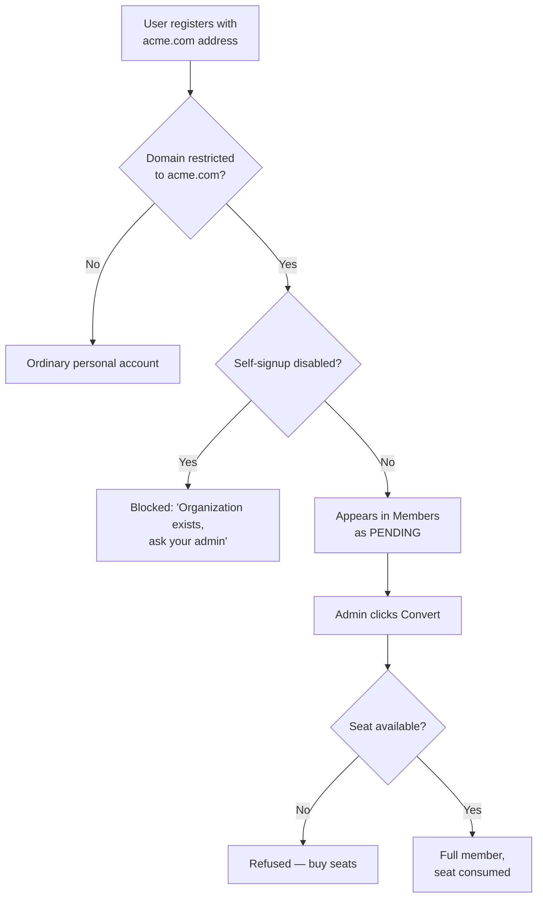

## 4.4 Signature Inbox (email-to-sign + OCR)

This is the invoice intake pipeline. Documents emailed to your organization's
address are queued, read by OCR, reviewed by a person, and then sent for
signature.

**The mailbox comes from WorkHub.** The address vendors send to is an Exchange
Online mailbox provisioned in the WorkHub console under *Email → Mailboxes*, and it
consumes a mailbox licence there. HubSign reads that mailbox using the credentials
entered under **Settings → Organization → Profile & Branding**, *Email-to-Sign Inbox* card. If intake stops working,
check the mailbox still exists and is licensed in WorkHub before looking at HubSign.

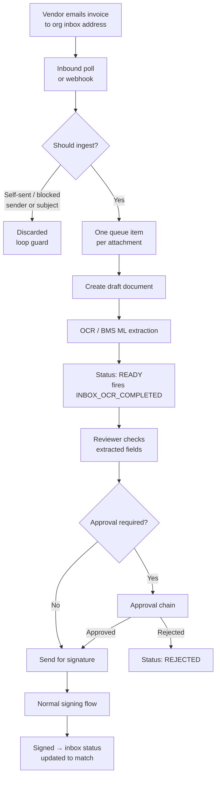

**One document per attachment.** Five invoices in one email produce five queue
items, five OCR runs and five workflow firings. They are deliberately not merged
— separate attachments are usually separate invoices from separate vendors.

**The loop guard.** A completion notification arriving back in the inbox with the
signed PDF attached would create a new document, complete it, send another
notification, and repeat. Two rules always apply and cannot be switched off:
mail from the system's own send address is discarded, and mail addressed by the
organization to its own inbox address is discarded. On top of that you can
configure blocked senders and blocked subjects.

**Live updates.** The queue updates itself as documents arrive and OCR finishes,
using database notifications rather than polling the browser.

**Search.** The search box matches across *every* extracted value — vendor,
invoice number, PO number, amounts, line items, addresses, phone numbers — plus
the document title and sender. It is not limited to a fixed list of fields.

**Reviewing.** **Review** opens the extracted data beside the document. Correct
anything OCR misread, then send for signature. A confidence score and a
"needs review" flag are shown per item.

## 4.5 Business Rules

**Settings → Automation → Business Rules** lets you refuse or flag an action based on the
document's own data. This is where "an invoice with no PO number cannot be
signed" lives.

A rule has four parts:

| Part | Meaning |
|---|---|
| **When** (gate) | The moment it is checked — before sending, before a recipient signs, before an inbox item is marked ready |
| **Condition** | JSONLogic describing **the problem**. True means the rule fires |
| **Then** (outcome) | **Block** the action, or **Warn** only |
| **Message** | Shown to the user when it fires — so write the fix, not the complaint |

> **Conditions describe the violation, not the requirement.** "PO is missing", not
> "PO is required".

### Available data

Rules read from a fact registry, grouped by namespace. The builder lists every
field available, generated from the registry itself:

| Namespace | Examples |
|---|---|
| `document` | title, status, page count, age |
| `recipients` | count, how many have signed, roles |
| `organization` | name, member count, settings |
| `actor` | who is performing the action |
| `attachments` | supporting file count |
| `ocr` | every extracted invoice field, plus confidence and reliability signals |

### Writing rules against OCR data

OCR output is a machine's guess, and the builder says so on screen. Two habits
matter:

**Use `ocr.has_plausible_po`, not `ocr.po_number`.** A presence check accepts a
misread — real extractions in this tenant include `po_number` values of
`"Box"`, `"licy"` and `"rt"`, all of which "are present". The derived fact
requires at least four characters including a digit.

**Pair presence checks with `ocr.confidence`** when the consequence is a hard
block.

### Examples

Invoice with no usable PO number:

```json
{ "!": [{ "var": "ocr.has_plausible_po" }] }
```

Over 300,000 with no usable PO:

```json
{ "and": [
  { ">": [{ "var": "ocr.total_amount" }, 300000] },
  { "!": [{ "var": "ocr.has_plausible_po" }] }
]}
```

No supporting paperwork attached:

```json
{ "==": [{ "var": "attachments.count" }, 0] }
```

### Testing before you enforce

**Test against a document** evaluates every rule at a gate against a real
document and shows both the verdict and the data the rules saw — without
enforcing anything and without signing. Use it, then switch the rule from Warn
to Block.

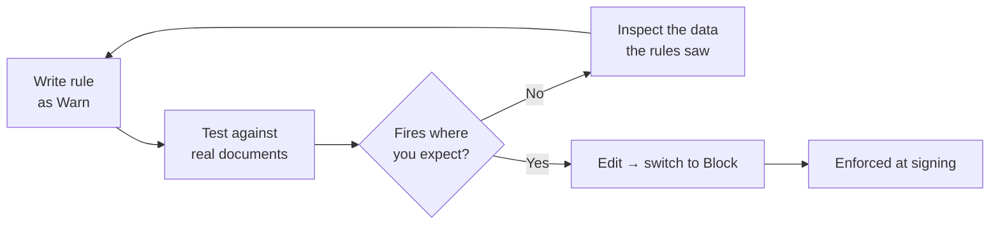

**Rule evaluation fails open.** If a rule's logic is malformed or the data cannot
be gathered, the action is allowed and the problem logged. A bug in one rule must
not stop every signature in the organization. Do not model a control that must
never be bypassed as a soft gate.

## 4.6 Approvals

**Settings → Automation → Approval Templates** defines the chains, and
**Settings → Automation → Approver Roles & Rules** names the groups a chain — or a
blocked signer asking for an exception — can be routed to. **Tasks → Approvals** is
the queue of decisions waiting on you.

An approval chain gates a document before it goes out for signature — typically
an emailed invoice that needs internal sign-off first. Templates support
sequential and parallel stages, five ways of resolving who approves (named user,
role, manager, dynamic field, or group), JSONLogic conditions on whether a stage
applies at all, validation rules, reminders, and chaining one template into
another.

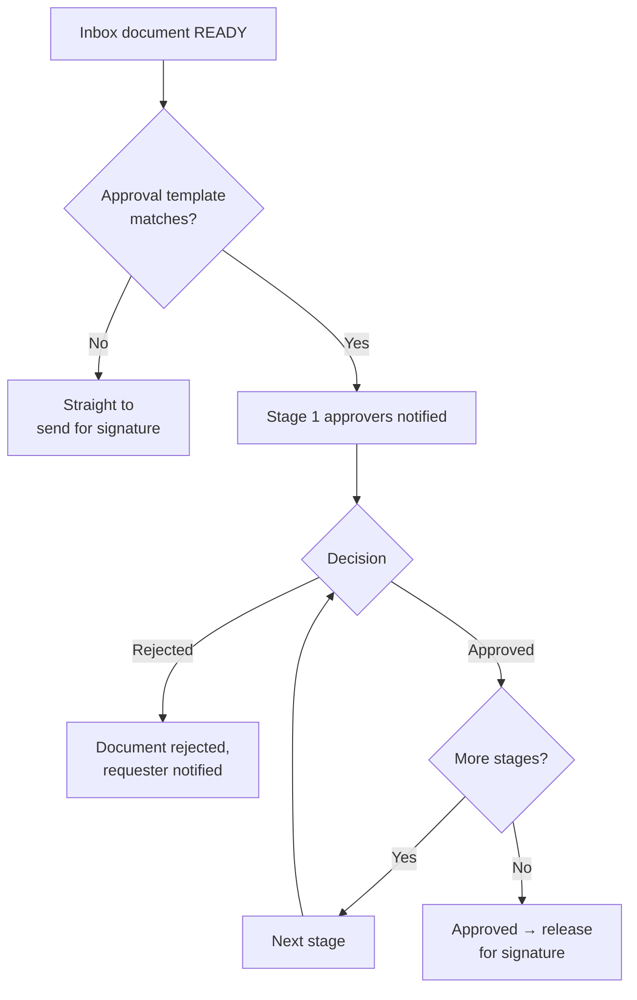

## 4.7 Workflows

**Settings → Automation → Workflows** is a general automation engine: a trigger, an
optional condition, and a graph of steps.

**Triggers**

- **Event** — a system event (see [Appendix A](#appendix-a--event-reference))
- **Schedule** — a cron expression in your timezone
- **Manual** — run on demand

**Step types**

| Step | Purpose |
|---|---|
| `CONDITION` | Continue only if a JSONLogic rule passes |
| `BRANCH` | Fork the path |
| `SET_VARIABLE` | Compute a value into the run context |
| `ACTION` | Do something (below) |

**Actions**

| Action | Does |
|---|---|
| `SEND_EMAIL` | Sends an email, optionally rendering a saved Email Template by key |
| `HTTP_REQUEST` | Calls an external URL — the integration workhorse |
| `NOTIFY` | Raises an in-app notification |
| `SEND_FOR_SIGNATURE` | Sends a document for signature, optionally adding recipients |
| `LOOKUP_METADATA` | Matches against your metadata records to enrich the run |

Any string in a step config supports `{{ path.to.value }}` templating against the
run context — the trigger payload, the document, the organization, and variables
you have set.

**Runs** are recorded per workflow with per-step status, so a failure shows which
step failed and why.

## 4.8 Email Templates

**Settings → Automation → Email Templates** stores reusable subject/HTML/text bodies,
each with a **key**. A workflow's `SEND_EMAIL` step references the key instead of
carrying markup inline, so the same wording is edited in one place.

Templates render `{{ }}` placeholders against the workflow run context.

> If a step references a key that does not exist, the step is **skipped** rather
> than sending a blank email.

## 4.9 Stamps, Metadata, Doc Manager

**Stamps** — image or text stamps (a company seal, "PAID", a registration mark)
positioned on a document and burned in at seal time.

**Metadata** — organization-defined reference records with keywords, used by
`LOOKUP_METADATA` to enrich workflow runs — for example resolving a vendor name
from an extracted string.

**Doc Manager (DMS)** — filing structure, classification, search and retrieval
requests over your document library, with **Access Control** governing who
sees what and a confidentiality classification per document. Filing and
retrieval both emit workflow events.

## 4.10 Integrations (Microsoft Teams)

**Settings → Organization → Integrations** connects one Microsoft Teams destination per
organization, by either transport:

- **Power Automate webhook** — paste an incoming webhook URL
- **Azure bot** — register the bot for richer, updatable cards

Add **channels**, each subscribing to all events or a chosen subset. Notifications
are sent as Adaptive Cards; with the bot transport a card can be updated in place
as a document progresses, rather than posting a new message per event.

Outbound URLs are validated against an allow-list before any request is made.

## 4.11 Billing and Recycle Bin

**Billing** — shows your subscription, seat count and period as provisioned for
your tenant. Seat availability is what gates member conversion: converting a
pending user consumes a seat, and conversion is refused when none are free.

Seats are purchased in the **WorkHub console** under *My Subscription*, not here.
This page reflects what your tenant has been allocated.

**Recycle Bin** — deleted **Doc Manager** records, restorable by an Org Admin or DMS
Admin. E-Sign documents do not appear here: a draft or pending document is deleted
outright and permanently, and a completed one is retained but not restorable from this
page. The interface mentions 30-day retention, but nothing currently purges expired
items automatically.

---

# Part III — Integrating with ERP and accounting systems

This is where signing stops being paperwork and starts being data. A signed
invoice, contract or authorization is an event your finance system should know
about, and HubSign already has the outbound mechanisms to tell it.

## 5.1 What is available today

Three integration surfaces exist and work now.

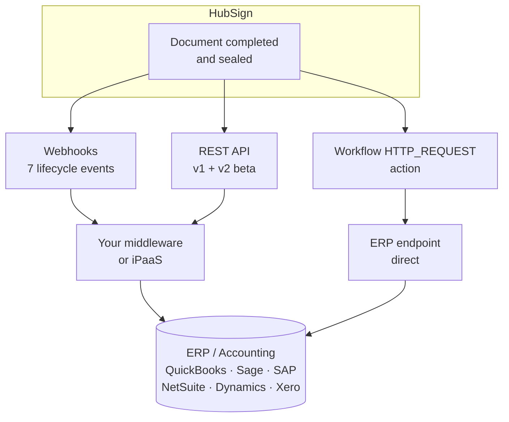

### 1. Webhooks — push, no polling

Configured per user or per team, subscribing to any of seven events:
`DOCUMENT_CREATED`, `DOCUMENT_SENT`, `DOCUMENT_OPENED`, `DOCUMENT_SIGNED`,
`DOCUMENT_COMPLETED`, `DOCUMENT_REJECTED`, `DOCUMENT_CANCELLED`.

`DOCUMENT_COMPLETED` fires after the document is sealed, so by the time your
endpoint is called the final PDF exists and is retrievable. This is the natural
trigger for posting to an ERP.

The payload carries the document, its recipients and their signing status.

### 2. REST API — pull and push

- **v1** (`/api/v1`) — documents, templates, recipients, fields, team members.
  Create a document, send it, download the signed file, inspect status.
- **v2 beta** — OpenAPI document published at the v2 beta URL for client generation.

Authentication is by **API token**, created per user or per team.

Endpoints that matter most for finance integration:

| Purpose | Endpoint |
|---|---|
| List documents | `GET /api/v1/documents` |
| Get one document | `GET /api/v1/documents/:id` |
| **Download the signed PDF** | `GET /api/v1/documents/:id/download` |
| Create from a template | `POST /api/v1/templates/:templateId/create-document` |
| Send for signature | `POST /api/v1/documents/:id/send` |

### 3. Workflow `HTTP_REQUEST` — integration without writing a service

The lowest-effort route. A workflow calls your ERP directly, with the payload
templated from the run context. No middleware to deploy.

Configuration: method, URL, headers, body, timeout (default 10s, max 30s), and
`saveResponseAs` to capture the ERP's response into a run variable — so a later
step can email the resulting voucher number, or store it.

## 5.2 Pattern A — Accounts payable invoice posting

The flow this platform was shaped around: an invoice arrives by email, is read,
approved, signed, and posted to the ledger.

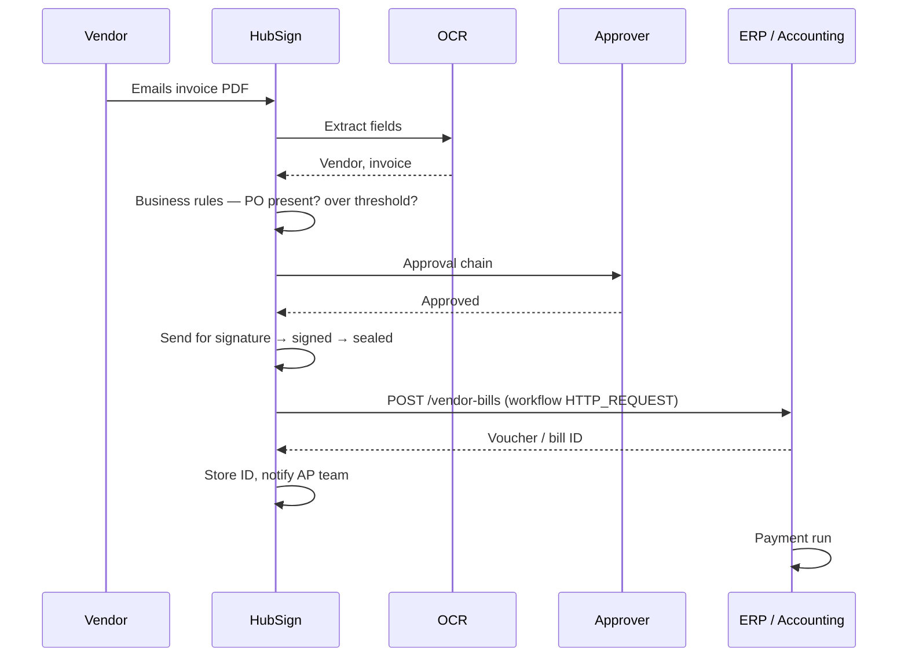

The extracted OCR fields are exactly an AP posting payload: vendor, invoice
number, PO number, invoice date, due date, currency, subtotal, tax, total. A
workflow on `DOCUMENT_COMPLETED` can post them with no re-keying.

**Example workflow step**

```json
{
  "type": "ACTION",
  "config": {
    "action": "HTTP_REQUEST",
    "method": "POST",
    "url": "https://erp.example.com/api/ap/vendor-bills",
    "headers": {
      "Authorization": "Bearer {{ vars.erpToken }}",
      "Idempotency-Key": "hubsign-doc-{{ document.id }}"
    },
    "body": {
      "vendorName": "{{ ocr.vendor_name }}",
      "invoiceNumber": "{{ ocr.invoice_number }}",
      "poNumber": "{{ ocr.po_number }}",
      "invoiceDate": "{{ ocr.invoice_date }}",
      "dueDate": "{{ ocr.due_date }}",
      "currency": "{{ ocr.currency }}",
      "subtotal": "{{ ocr.subtotal }}",
      "taxAmount": "{{ ocr.tax_amount }}",
      "totalAmount": "{{ ocr.total_amount }}",
      "signedPdfUrl": "{{ document.downloadUrl }}",
      "signedAt": "{{ document.completedAt }}"
    },
    "saveResponseAs": "erpBill"
  }
}
```

> **Send the idempotency key.** Retries and re-runs happen. Keying on the HubSign
> document ID lets the ERP recognise a duplicate post instead of creating a second
> liability.

## 5.3 Pattern B — Three-way match

Business rules can enforce the match *before* anyone signs, so a mismatch never
reaches the ledger.

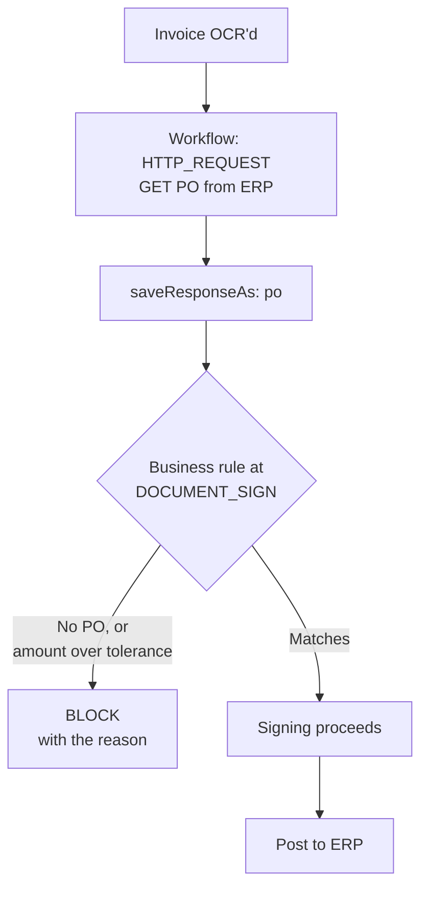

Fetch the PO and goods receipt from the ERP into run variables, compare against
the extracted invoice, and block on a discrepancy — with a message telling the
signer which figure disagrees.

## 5.4 Pattern C — Signed-document archival

Finance systems usually want the document itself attached to the transaction,
not just its numbers.

On `DOCUMENT_COMPLETED`, fetch `GET /api/v1/documents/:id/download` and attach
the PDF to the ERP record, the DMS, or both.

Two decisions to make deliberately:

**Which version to attach.** The full sealed PDF including the audit certificate
is the evidentiary copy and belongs in the archive. A copy without the
certificate is the one to circulate. Both are available — see
[3.6](#36-completion-the-audit-certificate-and-downloads).

**Where the system of record lives.** Attaching to the ERP and filing in the DMS
both make sense; deciding which one auditors will be pointed at does not happen
by itself.

## 5.5 Choosing an approach

| | Workflow `HTTP_REQUEST` | Webhook + middleware | REST API polling |
|---|---|---|---|
| **Effort** | Lowest — configuration only | Medium — a service to deploy | Medium |
| **Latency** | Immediate | Immediate | Poll interval |
| **Transform / map fields** | Templating only | Anything | Anything |
| **Retry, queue, dead-letter** | No | Yours to build | Yours to build |
| **Multiple destinations** | One step each | One consumer, fans out | — |
| **Best for** | One ERP, straightforward mapping | Several systems, real mapping logic, guaranteed delivery | Reconciliation, backfill |

**Recommendation.** Start with `HTTP_REQUEST` — it proves the mapping in an
afternoon. Move to webhook-plus-middleware when you need guaranteed delivery,
several destinations, or transformation beyond string templating.

## 5.6 Before you go live

**Delivery is not guaranteed by `HTTP_REQUEST`.** It has a timeout and it records
failure on the run, but it is not a durable queue — there is no automatic retry
with backoff and no dead-letter. If a posting must not be lost, put a queue
between HubSign and the ERP, and reconcile.

**Make every write idempotent.** Send the document ID as an idempotency key.

**Never send OCR figures straight to the ledger unreviewed.** Extraction is a
guess. The review step in the Signature Inbox exists for this reason, and
`ocr.confidence` exists so a rule can insist on it. A misread total posts a
wrong liability silently.

**Store credentials as workflow variables,** not inline in a step body that anyone
with workflow access can read.

**Your ERP endpoint has to be reachable from the internet.** HubSign runs in
WorkHub Cloud, so a workflow's `HTTP_REQUEST` and every webhook leave from there —
not from inside your network. An address like `https://erp.internal/...` will not
resolve. You have three options:

| Option | What it means |
|---|---|
| **Public HTTPS endpoint** | Expose a narrow, authenticated integration endpoint. Restrict it to WorkHub Cloud's egress addresses — ask your provider for the current list. |
| **Reverse tunnel or VPN** | Terminate a tunnel at a host that is publicly reachable and forward to the ERP. |
| **Pull instead of push** | Leave the ERP closed and have middleware inside your network poll the HubSign REST API for completed documents. Slower, but nothing inbound is opened. |

The pull option is worth considering seriously if opening anything to your finance
system is a problem. `GET /api/v1/documents` plus a stored watermark is enough.

**Reconcile.** Compare completed documents against posted transactions on a
schedule — a `SCHEDULE` workflow can do this and notify on drift.

---

## Appendix A — Event reference

### Webhook events — all fire today

| Event | When |
|---|---|
| `DOCUMENT_CREATED` | Document created |
| `DOCUMENT_SENT` | Sent for signature |
| `DOCUMENT_OPENED` | A recipient opened it |
| `DOCUMENT_SIGNED` | A recipient signed |
| `DOCUMENT_COMPLETED` | All signed, document sealed |
| `DOCUMENT_REJECTED` | A recipient rejected it |
| `DOCUMENT_CANCELLED` | Withdrawn |

### Workflow trigger events

| Event | Group | Dispatched today |
|---|---|---|
| `INBOX_EMAIL_RECEIVED` | Inbox | **Yes** |
| `INBOX_OCR_COMPLETED` | Inbox | **Yes** |
| `DMS_DOCUMENT_FILED` | DMS | **Yes** |
| `DMS_RETRIEVAL_REQUESTED` | DMS | **Yes** |
| `DMS_DOCUMENT_CLASSIFIED` | DMS | Not yet |
| `DOCUMENT_CREATED` | eSign | Not yet |
| `DOCUMENT_SENT` | eSign | Not yet |
| `DOCUMENT_OPENED` | eSign | Not yet |
| `DOCUMENT_SIGNED` | eSign | Not yet |
| `DOCUMENT_COMPLETED` | eSign | Not yet |
| `DOCUMENT_REJECTED` | eSign | Not yet |
| `DOCUMENT_CANCELLED` | eSign | Not yet |

> **Read this table before designing an integration.** The eSign events are
> selectable in the workflow builder but nothing dispatches them yet, so a
> workflow triggered on `DOCUMENT_COMPLETED` will never run. **Webhooks** on the
> same events do fire. Until the dispatch is wired, use a webhook — or the
> `INBOX_*` events, which do fire — as your trigger. See
> [Appendix B](#appendix-b--known-gaps).

### Business rule gates

| Gate | Checked |
|---|---|
| `DOCUMENT_SEND` | Before a document goes out for signature |
| `DOCUMENT_SIGN` | Before a recipient's signature is recorded |
| `INBOX_READY` | Before an inbox item is marked ready |

---

## Appendix B — Known gaps

Stated plainly so nobody designs around something that is not there.

| Gap | Effect | Workaround |
|---|---|---|
| eSign events do not dispatch to workflows | A workflow triggered on `DOCUMENT_COMPLETED` never runs | Use a webhook, or an `INBOX_*` trigger |
| `WARN` business rules are invisible to signers | A warning only reaches the server log | Use `Block` where the signer must see the message |
| No `REQUIRE_SIGNER` rule outcome | A rule cannot insert an extra approver — only block | Model as a `Block` telling the sender to add the approver, or add them in an approval chain |
| `HTTP_REQUEST` has no retry or dead-letter | A failed ERP post is recorded but not re-attempted | Queue in middleware for anything that must not be lost |
| Password-locked PDFs cannot offer certificate stripping | Those documents show a plain Download button | Download the full record |
| Inbox search is client-side | Fine at current volume; will not scale to thousands of queue items | Move to a server-side JSONB search when needed |

---

## Getting help

- **Your organization's administrators** — the first stop for access, seats,
  settings, rules and workflows
- **WorkHub console** (`console.workhubplatform.io`) — subscription, seats,
  mailboxes and domains for your tenant
- **Your service provider** — platform-level issues, and anything needing a
  tenant change you cannot make yourself
- **Audit trail** — every document carries a full audit log, visible on the
  document page under Recent activity
- **Document verification** — completed documents can be verified from the QR
  code and share link on the audit certificate
