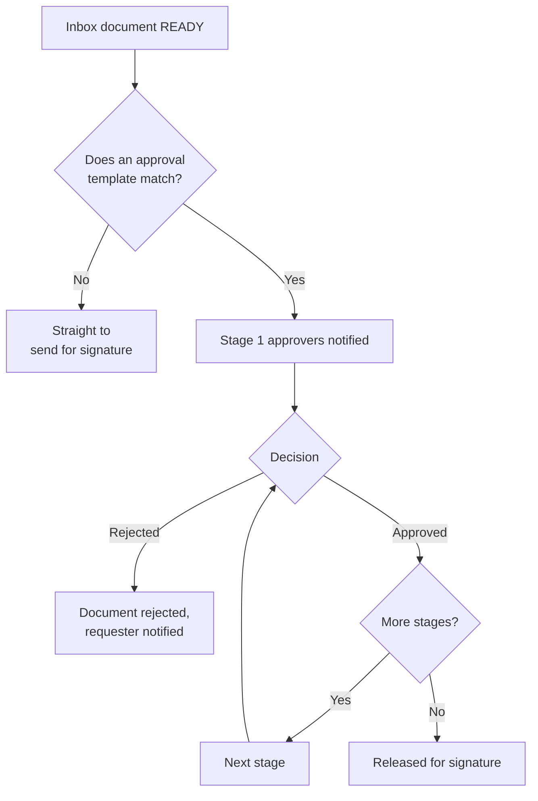

import { Callout, Steps } from 'nextra/components';

# Approvals

An approval chain gates a document **before** it goes out for signature — typically an
emailed invoice that needs internal sign-off first.

Two pages are involved:

- **Approval Setup** — define the templates
- **Approvals** — the queue of things waiting on a decision

## How a chain runs

## Building a template

<Steps>
### Add stages

Stages run in order. Within a stage, approvers can be required in sequence or in
parallel.

### Choose how each approver is resolved

Five methods are available: a named user, a role, the requester's manager, a value
taken from a document field, or a group. Field-based and manager-based resolution
mean one template can serve many departments.

### Add conditions

A stage can carry a condition so it only applies when relevant — for example, a
second stage only for invoices over a threshold. Below the threshold the stage is
skipped and the chain moves on.

### Add validation rules

Validation rules check the document itself before an approver is asked, so they are
not handed something obviously incomplete.

### Set reminders

Approvers who have not responded are chased automatically.
</Steps>

<Callout type="info">
  Templates can chain into one another, so a general approval can hand off to a
  specialist one without duplicating stages.
</Callout>

## Approvals vs Business Rules

They are easy to confuse. The difference is who decides.

| | [Business Rules](/organization/business-rules) | Approvals |
|---|---|---|
| **Decides** | The system, from the document's data | A person |
| **Question** | *Is this data acceptable?* | *Do I authorise this?* |
| **Outcome** | Block or warn, instantly | Approved or rejected, when someone responds |
| **Use for** | Missing PO, amount over threshold, low OCR confidence | Departmental sign-off, spending authority |

Use both: a rule to reject bad data automatically, then a chain for the human
authorisation. A rule catching a missing PO saves your approvers from reading an
invoice that was never going to be payable.

## Working the queue

**Approvals** lists what is waiting on you and what you have sent. Each item shows the
document, its extracted data, the current stage and who else is involved. Approve or
reject with a comment; a rejection reason is passed back to the requester.
