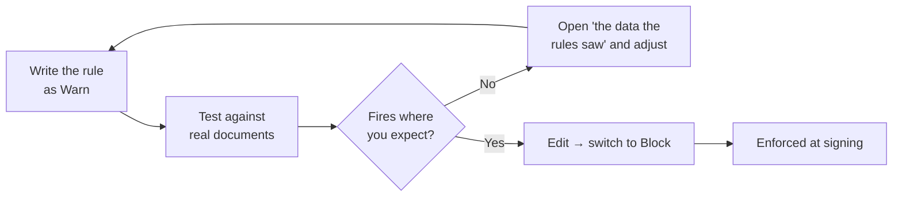

import { Callout, Steps } from 'nextra/components';

# Business Rules

**Organization → Business Rules** lets you refuse an action based on the document's
own data. This is where *"an invoice with no PO number cannot be signed"* lives.

## A rule has four parts

| Part | Meaning |
|---|---|
| **When** | The moment it is checked — before sending, before a recipient signs, or before an inbox item is marked ready |
| **Condition** | Describes **the problem**. When it is true, the rule fires |
| **Then** | **Block** the action, or **Warn** only |
| **Message** | Shown to the person when it fires — so write the fix, not the complaint |

<Callout type="warning">
  Conditions describe the **violation**, not the requirement. Write *"PO is missing"*,
  not *"PO is required"*. Getting this backwards makes a rule fire on every valid
  document.
</Callout>

## Building one

<Steps>
### Start from a preset

Four presets cover the common cases. Pick the closest and edit it.

### Set the outcome to Warn first

Not Block. You want to see where the rule fires before it starts refusing
signatures.

### Test it against real documents

Use **Test against a document** at the bottom of the page. Enter a document ID and
it shows the verdict *and* the data the rules saw. Nothing is enforced and nothing is
signed.

### Switch to Block

Edit the rule and change *Warn only* → *Block the action*. Signers now see your
message instead of a signature.
</Steps>



## What a rule can read

The builder lists every available field, generated from the system itself, grouped
by area: `document`, `recipients`, `organization`, `actor`, `attachments`, and `ocr`.

## Writing rules against OCR data

Two habits matter, because extraction is unreliable.

**Use `ocr.has_plausible_po`, not `ocr.po_number`.** A presence check accepts a
misread — real PO values in this tenant have included `"Box"`, `"licy"` and `"rt"`,
all of which "are present". The derived field requires at least four characters
including a digit.

**Pair a presence check with `ocr.confidence`** when the consequence is a hard block.

## Examples

Invoice with no usable PO number:

```json
{ "!": [{ "var": "ocr.has_plausible_po" }] }
```

Over 300,000 with no usable PO:

```json
{ "and": [
  { ">": [{ "var": "ocr.total_amount" }, 300000] },
  { "!": [{ "var": "ocr.has_plausible_po" }] }
]}
```

No supporting paperwork attached:

```json
{ "==": [{ "var": "attachments.count" }, 0] }
```

## Two things to know

**Rules fail open.** If a rule's logic is malformed or its data cannot be gathered,
the action is allowed and the problem logged. A bug in one rule must not stop every
signature in the organization. Do not model a control that must *never* be bypassed
as a soft gate.

**A Warn is currently invisible to the signer.** It records to the server log only.
If the person needs to read the message, use **Block**.

## Editing and turning off

**Edit** reopens a rule with its current settings, including the condition JSON.
**Turn off** disables it without deleting it — useful while you investigate a rule
firing more often than expected. Editing a rule that is turned off does not switch it
back on.
