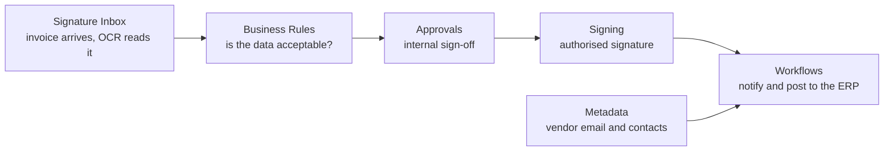

import { Callout } from 'nextra/components';

# Organization

Everything that belongs to your company rather than to one person lives here:
members and seats, branding, the invoice intake queue, approval chains, business
rules, workflows, your vendor reference data, stamps and notifications.

<Callout type="info">
  Most of these pages are **Org Admin** only. Ordinary members do not see the links,
  and typing the URL will not get them in either.
</Callout>

## Which page do I need?

| I want to… | Go to |
|---|---|
| See signing volume, turnaround, who is slow | [Dashboard](/organization/dashboard) |
| Add someone, or convert a pending user | [Members & Seats](/organization/members) |
| Change our logo, colours, or the audit certificate | [Settings & Branding](/organization/settings) |
| Buy more seats | [Billing & Seats](/organization/billing) |
| Have vendors email invoices straight in | [Signature Inbox](/organization/signature-inbox) |
| Stop a document being signed when data is wrong | [Business Rules](/organization/business-rules) |
| Require internal sign-off before a document goes out | [Approvals](/organization/approvals) |
| Automate a sequence of actions | [Workflows](/organization/workflows) |
| Look up a vendor's email from what OCR read | [Metadata](/organization/metadata) |
| Change the wording of an automated email | [Email Templates](/organization/email-templates) |
| Put a company seal or "PAID" mark on a document | [Stamps](/organization/stamps) |
| Post signing updates to a Teams channel | [Microsoft Teams](/organization/teams-notifications) |
| Send a signed invoice to our accounting system | [ERP & Accounting](/integrations) |
| Recover a document somebody deleted | [Recycle Bin](/organization/recycle-bin) |

## How the pieces fit together

The automation features are usually combined rather than used alone. A typical
accounts-payable setup uses four of them in sequence:

Each one is useful on its own. Add them in that order — intake first, then rules
once you know what your data actually looks like.

<Callout>
  Looking for the whole thing on one page, or something to print? The
  [Full Manual](/manual) covers every feature in a single document with all the
  reference tables.
</Callout>
