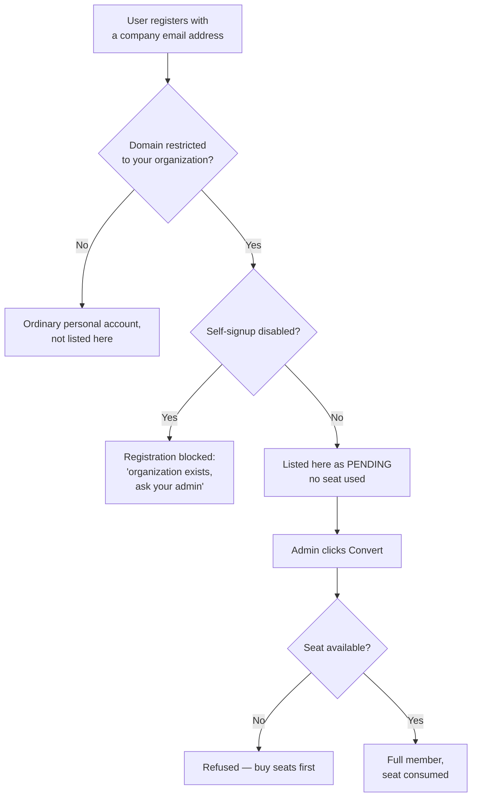

import { Callout, Steps } from 'nextra/components';

# Members & Seats

**Settings → Organization → Members & Roles** lists everyone in your organization, their role, and
their seat status.

## Roles

| Role | Can do |
|---|---|
| **Org Admin** | Everything, including settings, members, billing, rules and workflows |
| **Org Manager** | Day-to-day document work, the inbox and approvals |
| **Org Member** | Create, send and sign documents; sees only their own work |

Change a role from the row menu. Administrative pages are hidden from members and
the pages themselves refuse to load, so a member cannot reach them by typing a URL.

## Adding someone directly

<Steps>
### Invite

Enter their email and pick a role. They receive an email with a link to set a
password.

### Confirm the seat

A licensed seat is consumed. If none are free, the invitation is refused — buy
seats first under [Billing](/organization/billing).
</Steps>

## Pending users found by email domain

If you have set a member domain under
[Settings](/organization/settings), anyone who registers with an address on that
domain appears here automatically with **pending** status. They are not yet a
member and consume no seat.

**Convert** turns a pending user into a full member: they are moved into the
organization, a seat is consumed, and their company association is updated.

<Callout type="warning">
  Conversion is the moment a seat is spent. Check your seat count before converting
  a batch of pending users, or you will get part-way through and be refused.
</Callout>

## Seats

A seat is consumed per member, not per document or per signature.

**People you send documents to do not need a seat.** Recipients sign from an
emailed link without an account, whether or not they work for you. Seats are only
for people who log in to HubSign.

An Org Admin cannot change their own seat assignment — that guard exists so the
last administrator cannot lock themselves out.

## Removing someone

Removing a member frees their seat. Their documents are not deleted; they remain
with the organization. Consider changing their role to Member first if they are
simply moving on from an administrative duty.
