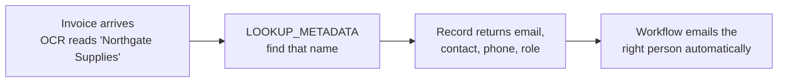

import { Callout, Steps } from 'nextra/components';

# Metadata

**Settings → Documents → Metadata Fields** is your own reference list — vendors, contacts, whoever
you deal with regularly — held as records that automation can look things up in.

## The problem it solves

OCR reads a vendor's **name** off an invoice. It does not read their email address,
their account number, or who at your company signs for them. Those live in your
head or in a spreadsheet.

Without Metadata, a workflow that should email the vendor has nowhere to get the
address from, so every such rule has to be hard-coded per vendor. With it, the
workflow looks the name up and gets everything else.



## What a record holds

| Field | Purpose |
|---|---|
| **Category** | The grouping — `vendor`, `signee`, whatever you need. Lookups are always scoped to one category |
| **Name** | The display name, and the value a lookup matches on |
| **Contact name** | The person at that organization |
| **Email** | Used when automation needs to email them |
| **Role** | e.g. `SIGNER` |
| **Phone** | Reference |
| **Keywords** | Alternative spellings that should match this record — see below |
| **OCR template** | The extraction template to prefer for this vendor's documents |

Records are unique on **category + name**. Importing the same name twice in a
category updates the existing record rather than creating a duplicate.

## The metadata file

Metadata is normally loaded in bulk from a CSV rather than typed in one at a time.

<Steps>
### Download the template

**Download template** gives you `hubsign-metadata-template.csv`, already containing
the correct header row and two example rows to overwrite.

Start from it rather than building a CSV by hand — the column order matters, and the
file is written with a UTF-8 byte-order mark so Excel opens accented names correctly
instead of mangling them.

### Fill it in

The columns, in order:

```
Category,Name,Contact name,Email,Role,Phone,Keywords,OCR template
vendor,Skidd View Ltd.,Jane Doe,jane.doe@skiddview.com,SIGNER,+1 555 0100,"skidd, skidd view, consulting",
vendor,Northgate Supplies,Sam Patel,sam@northgate.example,SIGNER,+1 555 0142,"northgate, northgate supplies",
```

Only **Category** and **Name** are required. Leave anything you do not have empty.

### Import CSV

Rows are created or updated in one pass. Any row that cannot be read is **skipped
and reported** rather than aborting the import — you get a count and the first ten
problem rows back, so a single bad line does not cost you the other four hundred.

Fix the reported rows and import the file again. Re-importing is safe: matching
records are updated, not duplicated.
</Steps>

<Callout type="info">
  Keep the CSV as your source of truth and re-import when it changes. It is easier to
  review a spreadsheet of two hundred vendors than two hundred screens, and the import
  is idempotent.
</Callout>

## Keywords — the field that does the real work

OCR does not return the name the way you filed it. An invoice header might read
`NORTHGATE SUPPLIES LTD`, `Northgate Supplies Limited`, or just `Northgate`. An exact
match on your stored name fails on all three.

Keywords are the alternative spellings that should resolve to this record. Put in
whatever actually appears on the documents:

```
northgate, northgate supplies, northgate ltd
```

Separate them with **commas or semicolons**. Semicolons are accepted deliberately —
a cell containing commas has to be quoted in CSV, and hand-edited files frequently
are not, so `a; b; c` survives where `a, b, c` unquoted would not.

<Callout type="warning">
  Keyword matching is a **substring** match, and the **first** matching record wins.
  A keyword of `north` would also match "Northern Tools" and "Northgate" — whichever
  is found first. Keep keywords specific enough to be unambiguous, and avoid short
  fragments.
</Callout>

## How a workflow uses it

The `LOOKUP_METADATA` action in [Workflows](/organization/workflows) has two modes.

**Exact** — you know the field holding the name:

```json
{
  "type": "ACTION",
  "config": {
    "action": "LOOKUP_METADATA",
    "category": "vendor",
    "key": "{{payload.extractedData.vendor_name}}",
    "saveAs": "vendor"
  }
}
```

The name is normalised — lowercased and trimmed — before matching, so casing and
stray spaces do not matter.

**Keyword** — omit `key`, and it scans text for each record's keywords instead. Left
blank, it searches **every OCR field on the document plus its type and title**, which
is usually what you want: the vendor name might have been read into any field, or
none.

```json
{
  "type": "ACTION",
  "config": {
    "action": "LOOKUP_METADATA",
    "category": "vendor",
    "saveAs": "vendor"
  }
}
```

Either way the match lands in the run variable you name, and later steps use it:

```
{{vars.vendor.email}}
{{vars.vendor.label}}
{{vars.vendor.phone}}
```

## When nothing matches

The action returns `found: false` rather than failing the run. **A later step that
emails `{{vars.vendor.email}}` will then have no address.**

Guard it with a `CONDITION` step on `vars.vendor.found` before any step that depends
on the lookup, so an unrecognised vendor skips the notification instead of attempting
to send to nobody.

That is also the signal to add the vendor — or add a keyword to an existing record.
An unmatched vendor is usually a spelling you have not captured yet, not a missing
record.
