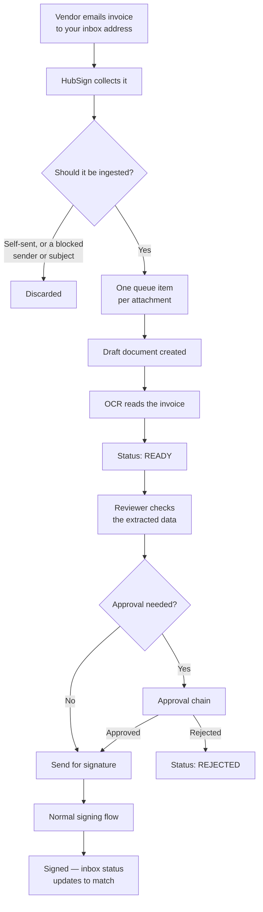

import { Callout, Steps } from 'nextra/components';

# Signature Inbox

**Inbox** is the invoice intake queue. Vendors email a PDF
to your organization's address; it is queued, read by OCR, checked by a person, and
sent for signature — without anyone downloading and re-uploading an attachment.

## How it flows

## Setting it up

<Steps>
### Get a mailbox

The address vendors send to is an Exchange Online mailbox provisioned in the
**WorkHub console** under *Email → Mailboxes*. It consumes a mailbox licence there.

### Connect it

In **Settings → Organization → Profile & Branding**, *Email-to-Sign Inbox* card, enable it and enter the inbox
address and its credentials.

### Tell your vendors the address

It is shown at the top of the Signature Inbox page with a **Copy** button.

### Add filters

Still under Email-to-Sign, add blocked senders and blocked subjects for anything
that should never become a document — statements, marketing, automated reports.
</Steps>

<Callout type="warning">
  If intake stops working, check the mailbox still exists and is licensed in the
  WorkHub console **before** debugging HubSign. A lapsed mailbox licence looks
  exactly like a broken integration.
</Callout>

## One document per attachment

Five invoices in one email produce five queue items, five OCR runs and five
separate documents. They are deliberately never merged — separate attachments are
usually separate invoices, often from different vendors, and merging them would make
them impossible to approve or post individually.

## The loop guard

A completion notification arriving back in the inbox with the signed PDF attached
would create a new document, complete it, send another notification, and repeat
forever. Two rules always apply and cannot be turned off:

- mail from the system's own send address is discarded
- mail your organization addressed to its own inbox address is discarded

Your blocked-sender and blocked-subject lists sit on top of those.

## Reviewing an item

**Review** opens the extracted data beside the document. Each item shows a
confidence score and a *needs review* flag.

Correct anything OCR misread, then send for signature.

<Callout type="warning">
  Check the figures before you send. Extraction is a machine's guess — in real data
  here, PO numbers have come out as `"Box"`, `"licy"` and `"rt"`. Never let an
  unreviewed amount reach your ledger. [Business rules](/organization/business-rules)
  can enforce this.
</Callout>

## Searching the queue

The search box matches **every extracted value** — vendor, invoice number, PO
number, amounts, line items, addresses, phone numbers — plus the document title and
sender. Quick filters narrow by status, document type, date and amount band.

## Live updates

The queue updates itself as mail arrives and OCR finishes. You do not need to
refresh the page.
