# HubSign

## Technical Architecture, Portable Deployment, Security & Data Governance

**Audience:** Engineering · Infrastructure · Security · Compliance
**Deployment model:** Single Komodo-managed instance on Ubuntu, PostgreSQL embedded in the stack
**Cloud targets:** Microsoft Azure · Amazon Web Services · DigitalOcean

> Version 2.3.1 · Prepared for internal technical review

---

## Agenda

| # | Section | Focus |
|---|---------|-------|
| 1 | **The product in one slide** | What we are deploying |
| 2 | **Architecture** | Monorepo, runtime, data layer |
| 3 | **The deployment model** | Komodo, single instance, embedded Postgres |
| 4 | **Cloud targets** | Azure · AWS · DigitalOcean, side by side |
| 5 | **Security architecture** | Identity, crypto, signing, secrets, trust boundaries |
| 6 | **Data governance** | Classification, retention, audit, residency, DSR |
| 7 | **Operations** | Backup, DR, upgrade, observability |
| 8 | **Hardening backlog** | What is not done yet, stated plainly |

---

# 1. The product in one slide

---

## What HubSign is

A **self-hostable electronic signature and document governance platform** — a sovereign
alternative to DocuSign and Adobe Sign, where the customer keeps the documents, the keys
and the audit trail inside their own tenancy.

**Four functional pillars:**

| Pillar | What it does |
|---|---|
| **e-Signature** | Field placement, ordered/parallel signing, per-recipient authentication, cryptographically sealed output PDF |
| **DMS** | Filing hierarchy (Location → Cabinet → Shelf → Bin), classification, retention & disposal, retrieval requests, versioning |
| **Automation** | Signature Inbox (inbound email → OCR → signing queue), approval chains, JSONLogic business rules, workflow engine |
| **Integration** | REST API, signed webhooks, OIDC SSO, Microsoft Teams, S3-compatible storage |

**The commercial claim we must defend technically:** *your documents never leave your cloud account.*
Everything in this deck exists to make that claim true and auditable.

---

# 2. Architecture

---

## System at a glance

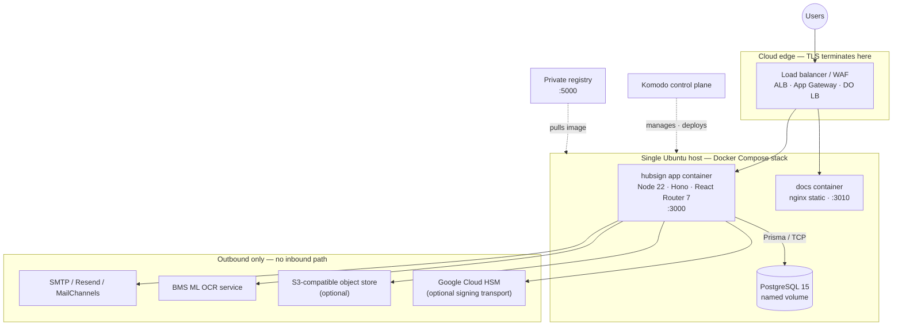

**One host. One application container. One database container. No control plane in the data path.**

---

## Monorepo layout

Turborepo over npm workspaces. Node ≥ 22, npm ≥ 10.7.

```
apps/
  remix/            React Router 7 app + Hono server — the only public surface
  documentation/    Static docs export → nginx (separate container)
  openpage-api/     Public status/openpage endpoints

packages/
  auth/             Sessions, OAuth/OIDC, passkeys, 2FA
  prisma/           Schema (2,936 lines · ~180 models) + 187 migrations
  trpc/             Typed RPC layer — the application API
  lib/              Domain logic: crypto, PDF, audit, jobs, DMS, workflows
  signing/          PKCS#12 and Cloud-HSM signing transports
  email/            React Email templates + transports
  ui/               Design system (Radix + Tailwind)
  api/              Public REST API surface
  ee/               Enterprise-licensed modules
```

**Why it matters for deployment:** one build produces one artifact. There is no
microservice fan-out to orchestrate, no service mesh, no inter-service auth to secure.

---

## Runtime: anatomy of the application container

Base image `node:22-slim`. Built once, promoted unchanged across environments.

| Component | Why it is in the image |
|---|---|
| **Node 22 + built Remix/Hono server** | The application itself — `node build/server/main.js` |
| **Chromium (Playwright)** | Renders the **audit certificate PDF** appended to every completed document. Not optional — it is part of the evidentiary output |
| **libvips / sharp** | Image processing for signature rendering and page thumbnails |
| **Prisma client + migration engine** | Schema is applied by the container at boot, not by a human |
| **`/app/certs`** | Runtime-materialised PKCS#12 signing certificate |

**Container is stateless.** All durable state lives in PostgreSQL and, optionally, object storage.
Kill it, restart it, replace the image — nothing is lost.

---

## Request path

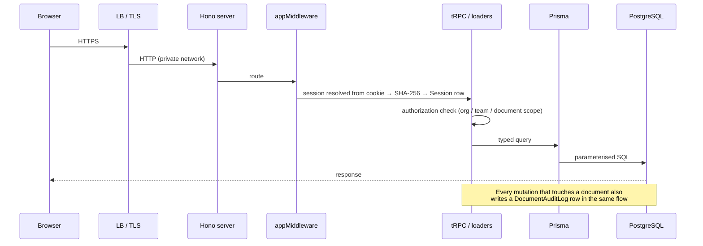

**Design point:** authorization is enforced in the tRPC procedure layer, not at the edge.
A misconfigured load balancer cannot bypass it.

---

## Data layer

**PostgreSQL 15** via Prisma. ~180 models, 187 forward-only migrations.

Domain groupings that matter for governance:

| Group | Representative models |
|---|---|
| Identity | `User`, `Session`, `Account`, `Passkey`, `PasswordResetToken`, `UserSecurityAuditLog` |
| Tenancy | `Organization`, `OrganizationMember`, `Team`, `TeamMember`, `OrgSeatPlan` |
| Signing | `Document`, `DocumentData`, `DocumentMeta`, `Recipient`, `Field`, `Signature`, `DocumentAuditLog` |
| DMS | `DmsDocument`, `DmsClassification`, `DmsPermission`, `DmsRetrievalRequest`, `DmsVersion`, `DmsAuditLog`, `DmsRecycleBinItem` |
| Automation | `Workflow`, `WorkflowRun`, `ApprovalTemplate`, `ApprovalRequest`, `BusinessRule`, `SignatureInboxItem` |
| Integration | `Webhook`, `WebhookCall`, `ApiToken`, `MsTeamsConnection` |

**Critical sizing fact:** with `NEXT_PUBLIC_UPLOAD_TRANSPORT=database`, PDF bytes are stored in
`DocumentData.data` **inside PostgreSQL**. The database *is* the document store. This drives disk,
backup size and restore time — covered in the storage decision slide.

---

# 3. The deployment model

## Single Komodo instance · Ubuntu · embedded PostgreSQL

---

## Why single-instance with embedded Postgres

This is a deliberate architectural choice, not a limitation we are hiding.

| Driver | Rationale |
|---|---|
| **Data sovereignty** | Documents, keys and audit trail sit on one disk, in one account, in one region. The blast radius and the compliance boundary are the same object |
| **Auditability** | A regulator asks "where is the data?" The answer is one VM and one volume — not a managed service whose replicas we do not control |
| **Cost predictability** | One VM + one disk. No per-GB managed-database premium on a workload that stores PDFs in-row |
| **Operational simplicity** | No failover topology, no read-replica lag, no connection pooler to tune. One `docker compose up` |
| **Portability** | Identical stack on Azure, AWS and DigitalOcean. No cloud-native primitive to re-platform |

**The honest trade-off:** the host is a single point of failure. Availability is a function of
snapshot cadence and rebuild time, not of clustering. Sizing and RTO are quantified later —
and the graduation path off this model is on a slide of its own.

---

## Komodo as the control plane

Komodo builds the image, holds the compose definition, injects secrets and drives deploys.
**It sits beside the data path, never inside it** — if Komodo is down, HubSign keeps serving.

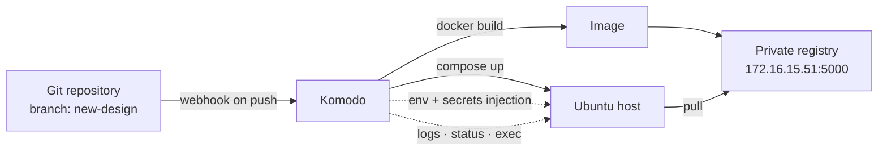

**Two Komodo resource types in play:**

- **Build** — repository + Dockerfile + build args → tagged image in the private registry
- **Stack** — the compose definition, environment variables and secrets → running containers

Compose files are mirrored in `docker/production/` so the deployed configuration is reviewable in git.
**Rule: change Komodo and the repository together, or the audit trail lies.**

---

## Komodo uses `docker compose up`, not `docker stack deploy`

A real operational lesson from this deployment, worth stating to avoid repeating it:

| Behaviour | Consequence |
|---|---|
| Container naming is `<project>-<service>-<n>` | Compose scheme, not Swarm's |
| Overlay networks need `attachable: true` | Otherwise a plain container cannot join a swarm-scoped overlay — deploy fails with *"network not manually attachable"* |
| Only **one replica** can publish a fixed host port | Compose has no routing mesh; a second replica dies on port conflict |
| `deploy.mode`, `update_config`, `placement` | Swarm-only — **silently ignored**. Do not assume rolling updates exist |
| A failed deploy leaves the old network behind | Compose reuses networks by name. Destroy the stack or delete the network before retrying |

**Implication for the SLA conversation:** a redeploy has a few seconds of downtime.
That is a property of the model, and we state it rather than implying zero-downtime we do not have.

---

## Host layout on Ubuntu

```
Ubuntu 22.04 / 24.04 LTS
├── Docker Engine + Compose v2
├── Komodo Periphery agent            ← control-plane agent, outbound to Komodo core
│
├── /var/lib/docker/volumes/
│   └── database/                     ← PostgreSQL data — MOUNT A DEDICATED BLOCK DEVICE HERE
│
├── /opt/hubsign/cert.p12             ← PKCS#12 signing certificate, 0400 root
│
└── containers
    ├── hubsign-app     :3000  ← reverse-proxied, the only public surface
    ├── hubsign-docs    :3010  ← static nginx, no secrets, no database
    └── database        :5432  ← MUST NOT be published to 0.0.0.0
```

**Two host-level rules that are non-negotiable in a cloud deployment:**

1. **The Postgres data volume must live on a separate, snapshot-capable block device** — not the
   OS disk. It is the recovery unit.
2. **The database port must never be published to a public interface.** Bind to `127.0.0.1` or
   drop the port mapping entirely — the app reaches Postgres over the internal Docker network by
   service name.

---

## The compose stack

```yaml
services:
  database:
    image: postgres:15
    environment: [POSTGRES_USER, POSTGRES_PASSWORD, POSTGRES_DB]
    healthcheck: ["CMD-SHELL", "pg_isready -U $POSTGRES_USER"]
    volumes: [database:/var/lib/postgresql/data]
    ports: ["127.0.0.1:6432:5432"]     # ← localhost-bound, admin access only

  hubsign:
    image: <registry>/futureedge/hubsign:latest
    depends_on: [database]
    environment: [ ~80 NEXT_PRIVATE_* / NEXT_PUBLIC_* variables ]
    ports: ["3000:3000"]
    volumes: ["/opt/hubsign/cert.p12:/opt/hubsign/cert.p12:ro"]

  docs:
    image: <registry>/futureedge/hubsign-docs:latest
    ports: ["3010:80"]

volumes: { database: }
networks: { hubsign-net: { driver: overlay, attachable: true } }
```

**Configuration surface: ~80 environment variables.** `NEXT_PRIVATE_*` are server-only secrets.
`NEXT_PUBLIC_*` are **inlined into the browser bundle at build time** — never put a secret in one.

---

## Boot sequence

`docker/start.sh` — deterministic, fail-fast, no manual step.

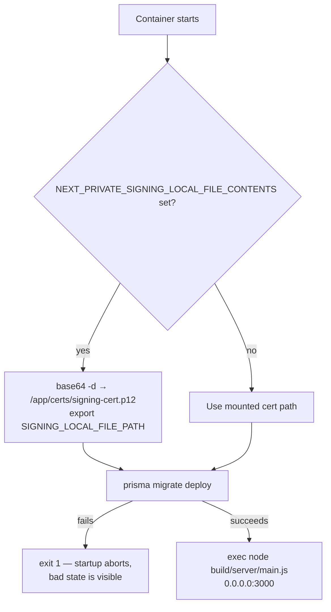

**Two properties worth calling out to the technical audience:**

- **Migrations run on every boot and abort startup on failure.** No half-migrated database serving
  traffic, no "did anyone run the migration?" conversation.
- **The signing certificate can be delivered as a base64 environment variable** — so it can live in
  Key Vault / Secrets Manager and never touch the image or a git repository.

---

## Sizing the single instance

| Deployment | vCPU | RAM | Data disk | Notes |
|---|---|---|---|---|
| **Pilot / ≤50 users** | 2 | 8 GB | 100 GB SSD | Tight. Chromium PDF rendering will contend with Postgres |
| **Production baseline** | 4 | 16 GB | 250 GB SSD | **Recommended starting point** |
| **Heavy / OCR + high volume** | 8 | 32 GB | 500 GB+ NVMe | Signature Inbox and bulk sends benefit most from this |

**What drives each dimension:**

- **RAM** — Chromium spawns per audit-certificate render; `sharp`/libvips holds image buffers;
  Postgres `shared_buffers` wants ~25% of host RAM.
- **Disk** — dominated by the storage transport decision. In `database` mode, budget
  *(average PDF size × 1.37 for base64) × documents × versions*, plus WAL and index overhead.
- **IOPS** — Postgres is the only serious consumer. Provision ≥3,000 IOPS on production.

**Growth signal to watch:** database size, not CPU. It is the first constraint you will hit.

---

## When to graduate off single-instance

Stated up front so nobody discovers it at the wrong moment.

| Signal | Move to |
|---|---|
| RTO requirement below ~30 minutes | Managed Postgres (RDS / Azure Flexible Server / DO Managed DB) + app-only host |
| Database > ~500 GB | Switch upload transport to S3 first — it is the cheaper fix |
| More than one app instance needed | External Postgres + object storage, then scale the app horizontally |
| Regulatory requirement for multi-AZ | Managed Postgres with synchronous replica |

**The architecture already supports every one of these** — `NEXT_PRIVATE_DATABASE_URL` and
`NEXT_PUBLIC_UPLOAD_TRANSPORT` are the only two variables that change. Nothing in the application
assumes the database is local.

---

# 4. Cloud targets

## Azure · AWS · DigitalOcean

---

## The portability principle

HubSign consumes **four generic primitives**. Every cloud provides all four.

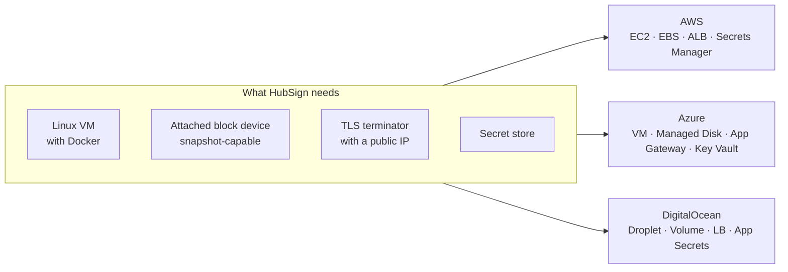

**No cloud-native lock-in.** No Lambda, no Functions, no proprietary queue, no vendor SDK in the
hot path. The same image runs unchanged in all three. Migration between clouds is a
`pg_dump`, a volume copy and a DNS change.

---

## Deployment topology — identical across all three clouds

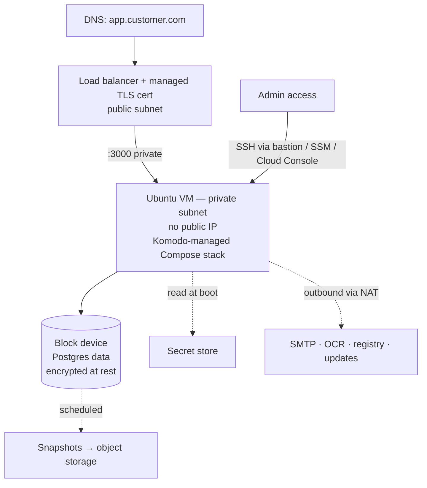

**Five invariants, regardless of cloud:**

1. VM in a **private subnet**, no public IP
2. Only the load balancer's security group/NSG may reach `:3000`
3. Egress through NAT, restricted to known destinations
4. Data volume encrypted at rest with a customer-managed key
5. **No SSH from the internet** — bastion, SSM Session Manager, or cloud console only

---

## Amazon Web Services

| Layer | Service | Configuration |
|---|---|---|
| Compute | **EC2** `m6i.xlarge` (4 vCPU / 16 GB) | Private subnet, IMDSv2 required, no public IP |
| Storage | **EBS gp3** 250 GB, 3,000 IOPS | Separate from root volume; encrypted with **KMS CMK** |
| Edge | **ALB** + **ACM** certificate | HTTPS listener, HTTP→HTTPS redirect, **AWS WAF** attached |
| Secrets | **Secrets Manager** (or SSM Parameter Store SecureString) | Injected into Komodo; rotation via Lambda where applicable |
| Object storage | **S3** | Native — set `NEXT_PRIVATE_UPLOAD_*`, use a **VPC Gateway Endpoint** so traffic never leaves the VPC |
| Backup | **AWS Backup** / **DLM** on EBS + versioned S3 bucket for `pg_dump` | Cross-region copy for DR |
| Network | VPC, private + public subnets, NAT Gateway, Security Groups | Least-privilege SG chain: ALB → EC2 only |
| Access | **SSM Session Manager** | No SSH keys, no bastion, full session logging to CloudTrail |
| Monitoring | CloudWatch Agent + Logs | Container logs, disk-usage alarm on the data volume |

**AWS is the strongest fit** — S3 is natively supported by the upload transport, and SSM removes
SSH from the threat model entirely.

---

## Microsoft Azure

| Layer | Service | Configuration |
|---|---|---|
| Compute | **VM** `Standard_D4s_v5` (4 vCPU / 16 GB) | Private subnet, no public IP, Trusted Launch enabled |
| Storage | **Premium SSD v2** 250 GB data disk | Encrypted with **customer-managed key** in Key Vault; host-based encryption on |
| Edge | **Application Gateway v2 (WAF_v2)** or **Front Door** | Managed TLS, OWASP ruleset, HTTP→HTTPS redirect |
| Secrets | **Azure Key Vault** | RBAC-scoped; signing cert stored as a Key Vault **certificate**, delivered base64 to the container |
| Object storage | **Blob Storage** — ⚠️ **see caveat** | Not S3 API-compatible |
| Backup | **Azure Backup** on the VM + disk snapshots; `pg_dump` → Blob with immutability policy | GRS for cross-region DR |
| Network | VNet, NSGs, Azure Firewall or NAT Gateway | NSG allows only App Gateway subnet → `:3000` |
| Access | **Azure Bastion** + Entra ID login for Linux | No public SSH, no local key management |
| Monitoring | Azure Monitor + Log Analytics workspace | Container insights, disk alerts |

**⚠️ The Azure storage caveat — read this before promising anything**

`NEXT_PRIVATE_UPLOAD_*` speaks the **S3 API**. Azure Blob does not. On Azure, choose one of:

1. **`NEXT_PUBLIC_UPLOAD_TRANSPORT=database`** — simplest, and correct for single-instance. Size the disk accordingly.
2. **MinIO sidecar** on the same host as an S3 gateway, backed by its own Premium disk.
3. **Cross-cloud S3** — technically works, but breaks the data-residency story. **Not recommended.**

**Recommendation for Azure: option 1.** It keeps the sovereignty claim intact and matches the single-instance model.

---

## DigitalOcean

| Layer | Service | Configuration |
|---|---|---|
| Compute | **Droplet** — General Purpose `g-4vcpu-16gb` | VPC-only networking; disable public IPv4 where the LB fronts it |
| Storage | **Block Storage Volume** 250 GB | Encrypted at rest; attached at `/mnt/hubsign-data` |
| Edge | **DO Load Balancer** + **Let's Encrypt** managed certificate | Auto-renewing TLS, HTTP→HTTPS redirect |
| Secrets | Komodo-held secrets, or DO App Platform secrets / HashiCorp Vault | DO has no first-party KMS equivalent — **note this in risk register** |
| Object storage | **Spaces** | **S3-compatible** — works natively with `NEXT_PRIVATE_UPLOAD_*` |
| Backup | Droplet Snapshots + Volume Snapshots (scheduled) + `pg_dump` → Spaces | Enable Spaces versioning |
| Network | **VPC** + **Cloud Firewall** | Inbound `:3000` from LB tag only; `:22` from bastion tag only |
| Access | Bastion Droplet or DO Console | SSH keys only, password auth disabled |
| Monitoring | DO Monitoring + alert policies | Disk, memory, droplet health |

**DigitalOcean is the lowest-cost and fastest to stand up.** Spaces gives native S3 storage.
**The gap to disclose:** no managed HSM/KMS with customer-managed key control comparable to
AWS KMS or Azure Key Vault — secret custody rests with Komodo and the host. For customers with
a KMS mandate, steer to AWS or Azure.

---

## Side by side

| Dimension | AWS | Azure | DigitalOcean |
|---|---|---|---|
| Reference instance | `m6i.xlarge` | `Standard_D4s_v5` | `g-4vcpu-16gb` |
| S3-native uploads | ✅ S3 | ❌ use `database` or MinIO | ✅ Spaces |
| Managed TLS at edge | ✅ ACM | ✅ App Gateway / Front Door | ✅ Let's Encrypt |
| Managed WAF | ✅ AWS WAF | ✅ WAF_v2 | ⚠️ third-party (Cloudflare) |
| Customer-managed keys | ✅ KMS CMK | ✅ Key Vault CMK | ⚠️ limited |
| SSH-less admin access | ✅ SSM | ✅ Bastion + Entra | ⚠️ bastion droplet |
| Automated disk backup | ✅ AWS Backup | ✅ Azure Backup | ✅ scheduled snapshots |
| Relative monthly cost | Highest | High | **Lowest** |
| **Best for** | Regulated / KMS mandate | Microsoft-aligned enterprise, Entra SSO | Cost-sensitive, fast pilots |

**Recommendation by customer profile:**
Regulated enterprise → **AWS**. Microsoft-shop with Entra ID and Teams → **Azure**.
SMB, pilot, or price-led → **DigitalOcean**.

---

## The storage transport decision

The single highest-impact configuration choice. Make it consciously, before go-live.

| | `database` (default) | S3-compatible |
|---|---|---|
| Set | `NEXT_PUBLIC_UPLOAD_TRANSPORT=database` | `=s3` + `NEXT_PRIVATE_UPLOAD_*` |
| Bytes live in | `DocumentData.data` (base64 in Postgres) | Object store; DB holds the key |
| Backup unit | One `pg_dump` — **everything in one file** | DB dump **plus** bucket replication |
| Restore | Single-step, atomically consistent | Two-step; risk of drift between DB and bucket |
| Disk growth | ~1.37× raw PDF size, on the DB volume | Negligible on the DB volume |
| Practical ceiling | ~500 GB before dumps become painful | Effectively unbounded |
| Availability of blobs | Tied to the host | Independent, 11-nines durable |

**Guidance:**

- **Under ~50k documents, or on Azure → `database`.** Simpler, and the backup story is one artifact.
- **Above that, or where documents are large → S3/Spaces.** And when you switch, **backup becomes
  a two-artifact problem** — the runbook must cover both, and restores must be tested together.

---

## Network edge and TLS

```
Internet
   │  HTTPS 443 — TLS 1.2+ only, modern cipher suite
   ▼
Load balancer  ── WAF ruleset (OWASP CRS) ── rate limiting at the edge ★
   │  HTTP 3000 — private subnet, security-group restricted
   ▼
hubsign container
```

| Control | Setting |
|---|---|
| TLS version | 1.2 minimum, 1.3 preferred |
| Certificate | Cloud-managed with automatic renewal (ACM / App Gateway / LE) |
| HTTP | 301 redirect to HTTPS at the load balancer |
| HSTS | Set at the edge — `max-age=31536000; includeSubDomains` |
| ★ Rate limiting | **Enforced at the WAF/LB.** The application has no built-in rate limiter — see hardening backlog |
| `NEXT_PUBLIC_WEBAPP_URL` | Must be the public HTTPS URL — signing links and OAuth redirects derive from it |
| `NEXT_PRIVATE_INTERNAL_WEBAPP_URL` | `http://localhost:3000` — internal calls skip the round trip through the edge |

**Getting `NEXT_PUBLIC_WEBAPP_URL` wrong breaks signing emails and OAuth callbacks.** It is
baked into the client bundle at build time — changing it requires a rebuild, not a restart.

---

# 5. Security architecture

---

## Trust boundaries

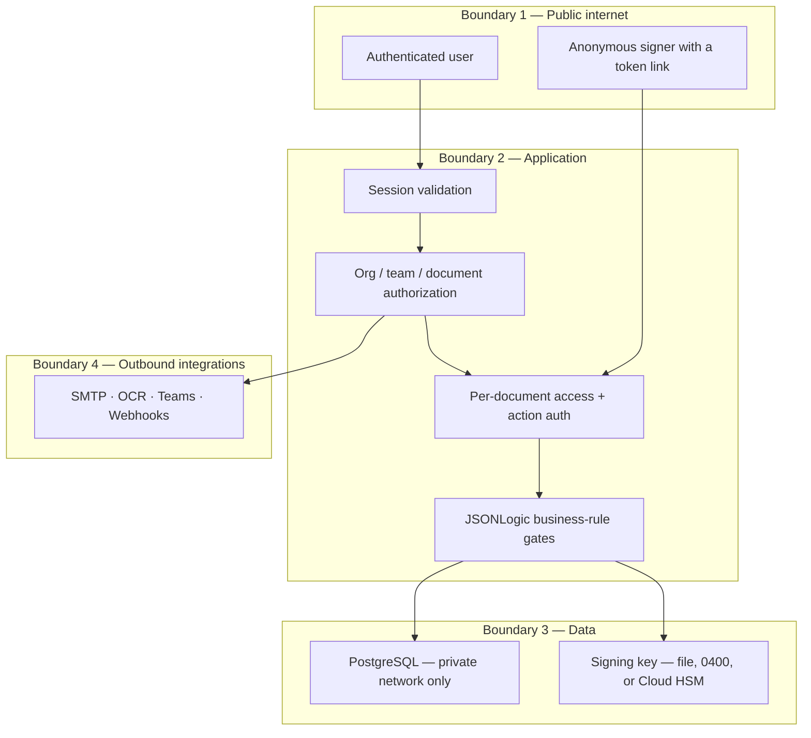

**Highest-risk paths, and where they are controlled:**

| Path | Control |
|---|---|
| Anonymous signer link | Token-scoped to one recipient + optional access auth + optional document password |
| Inbound email → Signature Inbox | Shared-secret header (`NEXT_PRIVATE_INBOUND_EMAIL_SECRET`) |
| Outbound webhooks | Per-webhook secret; **operator-supplied URLs — SSRF surface, egress-restrict** |
| OCR service call | Per-organization credentials; keep the service on the private network |

---

## Identity and authentication

| Method | Implementation |
|---|---|
| **Email + password** | Bcrypt-hashed; `mustChangePassword` flag supported |
| **Google OAuth** | OIDC via `accounts.google.com` well-known |
| **Generic OIDC / SSO** | Any compliant IdP — Entra ID, Okta, Keycloak. Per-organization configuration supported |
| **Passkeys (WebAuthn)** | Full registration and authentication flow |
| **TOTP 2FA** | With single-use backup codes |

**Session design:**

- Token = **20 bytes from `crypto.getRandomValues()`**, base32-encoded
- **Only the SHA-256 hash is stored.** A database dump does not yield usable session tokens
- Lifetime **30 days**, sliding
- Every session records `ipAddress` and `userAgent`
- **Single-session enforcement for organization members** — a new login invalidates prior sessions.
  Serves licence integrity *and* limits credential-sharing blast radius

⚠️ `NEXT_PRIVATE_OIDC_SKIP_VERIFY` must be `false` in production. It disables IdP verification.

---

## Per-document authentication — the differentiator

Two independent axes, configurable globally, per document, and per recipient.

| | **Access auth** — to *open* | **Action auth** — to *sign* |
|---|---|---|
| `ACCOUNT` | Must be logged in as the recipient | Must re-authenticate as the recipient |
| `PASSKEY` | — | WebAuthn assertion required at signing |
| `TWO_FACTOR_AUTH` | — | TOTP required at signing |
| `EXPLICIT_NONE` | Open link | Sign without challenge |

Plus a **document password** (`DocumentMeta`) as an independent layer.

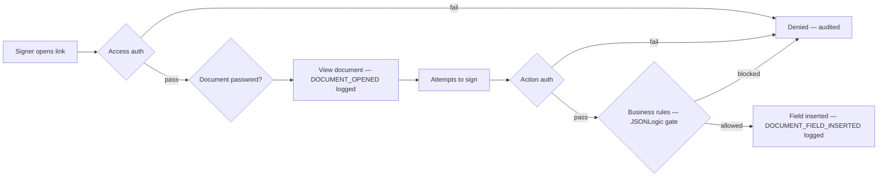

**Every decision on this path, allow or deny, writes an audit row.**

---

## Authorization model

Three nested scopes. Each is checked in the procedure layer.

```
Organization  →  Team  →  Document / DMS record
```

**Organization roles:** `ORG_ADMIN` · `DMS_ADMIN` · `TEAM_ADMIN` · `MANAGER` · `MEMBER`

**DMS permission actions** — 12 discrete, independently grantable rights:

| | | |
|---|---|---|
| `DMS_VIEW` | `DMS_UPLOAD` | `DMS_DOWNLOAD` |
| `DMS_EDIT` | `DMS_DELETE` | `DMS_EXPORT` |
| `DMS_MANAGE_FILING` | `DMS_MANAGE_TYPES` | `DMS_MANAGE_RETENTION` |
| `DMS_APPROVE_WORKFLOWS` | `DMS_APPROVE_RETRIEVALS` | `DMS_VIEW_AUDIT_TRAIL` |

**Two governance-critical separations built into this model:**

- **`DMS_VIEW_AUDIT_TRAIL` is separate from `DMS_VIEW`** — you can read a document without reading
  who else read it, and vice versa.
- **`DMS_MANAGE_RETENTION` and `DMS_APPROVE_RETRIEVALS` are separate from `DMS_DELETE`** — the
  person who *approves* disposal need not be the person who *executes* it. That is segregation
  of duties, enforced by the permission model rather than by policy documents.

Document visibility is additionally scoped by `DocumentVisibility` and `DmsConfidentiality`.

---

## Cryptography

| Layer | Mechanism |
|---|---|
| **In transit — external** | TLS 1.2+, terminated at the cloud load balancer |
| **In transit — internal** | Private Docker network; database never crosses a public interface |
| **At rest — volume** | Cloud disk encryption with a customer-managed key (KMS / Key Vault) |
| **At rest — application field level** | **XChaCha20-Poly1305** (`@noble/ciphers`), managed nonces, SHA-256 key derivation |
| **Session tokens** | SHA-256; plaintext never stored |
| **Passwords** | Bcrypt |
| **API tokens** | SHA-512 hashed, optional expiry |
| **Document signature** | PKCS#12 RSA, or Google Cloud HSM |

**Two-key design — this is what makes rotation possible:**

- `NEXT_PRIVATE_ENCRYPTION_KEY` — primary, for sensitive application data
- `NEXT_PRIVATE_ENCRYPTION_SECONDARY_KEY` — for time-limited encrypted payloads (`expiresAt`-bearing tokens and links)

**Losing these keys is unrecoverable.** They belong in KMS/Key Vault, in the backup runbook, and
in the DR test. ⚠️ *Startup validation that the two keys differ and are non-default is currently
commented out — see hardening backlog.*

---

## Document signing and sealing

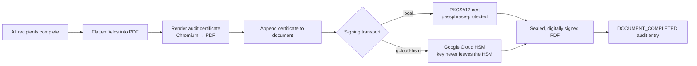

| Transport | `NEXT_PRIVATE_SIGNING_TRANSPORT` | Key custody |
|---|---|---|
| Local certificate | `local` | PKCS#12 file on host or from secret store, passphrase-protected |
| **Google Cloud HSM** | `gcloud-hsm` | **FIPS 140-2 Level 3 — private key is never exportable** |

**For customers with an HSM mandate, `gcloud-hsm` is the answer today.** For AWS CloudHSM or
Azure Managed HSM, the transport interface is a single function (`signPdf`) — a new transport is
a contained, well-bounded piece of work, not an architectural change.

**The sealed output is self-verifying:** the signature validates in Adobe Acrobat without HubSign.
The evidence outlives the platform.

---

## Secrets management per cloud

**Never in the image. Never in git. Never in a `NEXT_PUBLIC_*` variable.**

| Secret | AWS | Azure | DigitalOcean |
|---|---|---|---|
| DB password | Secrets Manager | Key Vault secret | Komodo secret |
| `NEXTAUTH_SECRET` | Secrets Manager | Key Vault secret | Komodo secret |
| Encryption keys ×2 | Secrets Manager + KMS CMK | Key Vault + CMK | Komodo secret |
| Signing cert + passphrase | Secrets Manager (base64) | Key Vault **certificate** | Komodo secret (base64) |
| SMTP / OCR / Teams credentials | Secrets Manager | Key Vault | Komodo secret |

**Delivery path:** secret store → Komodo → container environment → `start.sh` materialises the
certificate to `/app/certs` at boot. The certificate exists only in the container's ephemeral
filesystem — it is never committed, never in a layer, and disappears when the container does.

⚠️ **Before any customer deployment:** every default value in `docker/production/compose.yml`
(database password, `NEXTAUTH_SECRET`, both encryption keys) must be replaced. Those defaults are
in a public repository. Treat them as compromised.

---

## Key and credential rotation

| Credential | Cadence | Method |
|---|---|---|
| Session secret | On suspicion | Rotate `NEXTAUTH_SECRET` — invalidates all sessions |
| Database password | 90 days | Rotate in Postgres + secret store, redeploy stack |
| API tokens | Per policy | Per-token `expires`; revoke individually |
| Webhook secrets | Per integration | Regenerate; consumer must update |
| Signing certificate | At CA expiry | New PKCS#12; **previously sealed documents stay valid** — the signature is bound to the cert at sealing time |
| Encryption keys | Planned exercise | Two-key design supports a staged migration; **requires a documented, rehearsed procedure — currently a gap** |

**The honest statement to make:** encryption-key rotation is *architecturally supported* but not
yet *operationally documented*. That belongs on the roadmap, not in a claim.

---

## Application-layer defences already in place

| Threat | Control |
|---|---|
| SQL injection | Prisma parameterised queries throughout; no raw SQL in request paths |
| XSS | React auto-escaping; no `dangerouslySetInnerHTML` in user-content rendering |
| CSRF | `SameSite` cookies; tRPC POST-only mutations |
| Session fixation | Session regenerated on login; single-session enforcement for org members |
| Credential stuffing | 2FA, passkeys, `SIGN_IN_FAIL` / `SIGN_IN_2FA_FAIL` audit types for detection |
| Privilege escalation | Authorization checked per procedure, not at the edge |
| Unauthorised document access | Recipient-scoped tokens + access auth + document password |
| Insider deletion | Recycle bin, versioning, immutable audit rows, disposal approval workflow |
| Tampering with signed output | Digital signature — any modification invalidates it |

---

## Hardening backlog — stated plainly

These are **known and open**. A technical audience will ask; we answer first.

| Gap | Risk | Mitigation available today | Fix |
|---|---|---|---|
| **No application-level rate limiting** | Brute force, enumeration, abuse | **WAF / LB rate limiting at the edge — mandatory for every deployment** | Add middleware-level limiter |
| **No CSP / security headers** | XSS impact amplification, clickjacking | Set CSP, `X-Frame-Options`, `X-Content-Type-Options`, HSTS **at the load balancer** | Add to Hono middleware |
| **Encryption-key validation disabled** | Default or duplicate keys could ship unnoticed | Deployment checklist verifies both keys | Re-enable startup assertion |
| **Default secrets in the compose file** | Compromise if deployed unchanged | Komodo injects real secrets; never use file defaults | Remove defaults; fail closed |
| **Database port published** | Direct DB exposure if the firewall is wrong | Bind `127.0.0.1` or drop the mapping | Change committed compose |
| **Webhook URLs are operator-supplied** | SSRF to internal services | Restrict egress at NAT/firewall | Allow-list + internal-range denial |
| **No `/health` endpoint** | Load balancers cannot health-check precisely | TCP check on `:3000` | Add `/api/health` with a DB probe |
| **Redeploy causes brief downtime** | Seconds of unavailability | Schedule in a maintenance window | Blue-green when moving off single-instance |

**Positioning:** every item is either edge-mitigated today or scoped. **None is a blocker for a
correctly configured deployment** — but each must be on the deployment checklist, not left to memory.

---

# 6. Data governance

---

## Data map — what we hold, and where

| Category | Where | Sensitivity |
|---|---|---|
| **Identity** | `User`, `Account`, `Passkey` | Name, email, hashed password, IdP subject |
| **Session telemetry** | `Session`, `UserSecurityAuditLog` | **IP address, user agent** — personal data under GDPR |
| **Document content** | `DocumentData` (or S3) | **Highest** — arbitrary customer content, potentially special-category |
| **Signer identity** | `Recipient`, `Signature` | Name, email, signature image, signing timestamp |
| **Signing evidence** | `DocumentAuditLog` | Actor name, email, userId, **IP, user agent**, per event |
| **DMS records** | `DmsDocument` (incl. `ocrText`) | Content **plus extracted text** — OCR text is a copy of the content |
| **DMS access trail** | `DmsAuditLog` | Action, user, IP |
| **Inbound email** | `SignatureInboxItem` | Sender address, attachments, OCR-extracted fields |
| **Integration credentials** | `Organization` (OCR), `Webhook`, `ApiToken` | Secrets — encrypted or hashed |
| **Webhook payload history** | `WebhookCall` | **Request/response bodies may contain document metadata** |

**Two items teams routinely miss in a DPIA:** `DmsDocument.ocrText` is a **second copy of document
content in plain text**, fully searchable. And `WebhookCall` retains request and response bodies.
Both must appear in the data inventory and in retention policy.

---

## Classification

`DmsConfidentiality` — four levels, enforced by the permission layer, not by convention:

| Level | Intended use |
|---|---|
| `PUBLIC` | No restriction |
| `INTERNAL` | Organization members (**default**) |
| `CONFIDENTIAL` | Explicitly permitted users only |
| `RESTRICTED` | Named individuals; every access audited |

Composed with:

- **`DmsClassification`** — customer-defined scheme (records series, file plan)
- **`DmsDocumentType`** — drives retention rules and auto-filing
- **`DocumentVisibility`** — signing-side scope
- **`DmsPermission`** — per-document ACL, with `DmsPermissionLevel`
- **`DmsOrgPermission`** — organization-wide grants

**A document carries its classification through filing, retrieval, sharing and disposal.**
Classification is metadata on the record, not a folder convention that erodes over time.

---

## Retention and disposal lifecycle

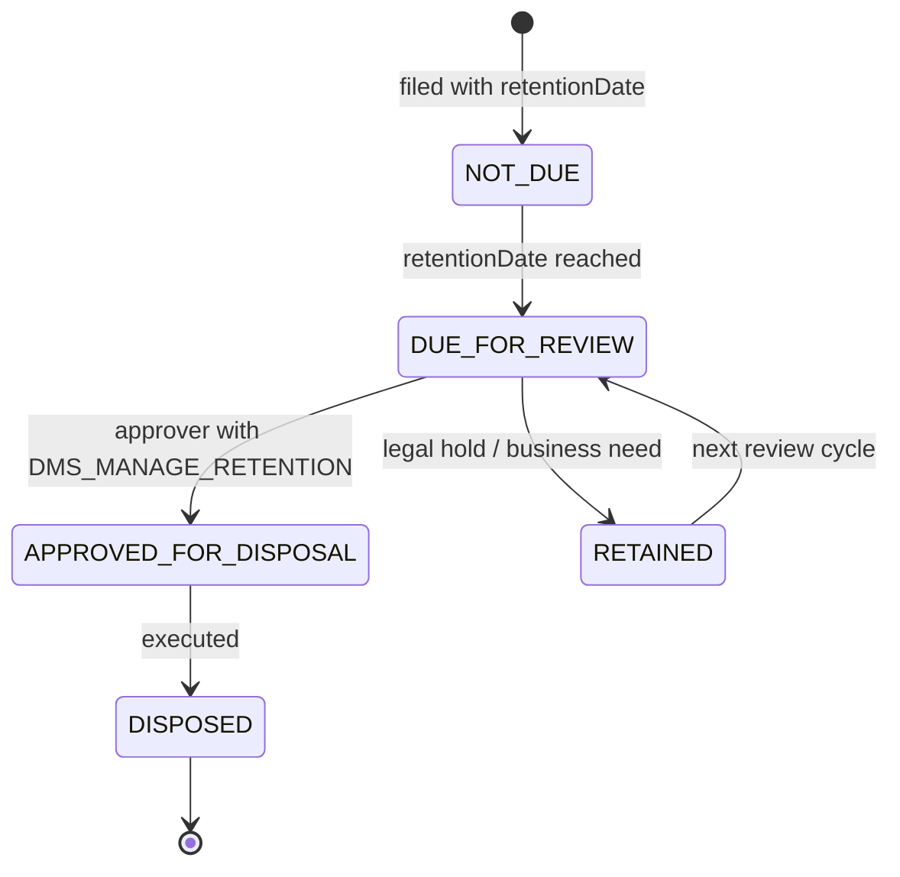

**Fields backing this on `DmsDocument`:**
`retentionDate` · `expiryDate` · `disposalStatus` · `disposalDate` · `disposalApprovedById` · `disposalNotes`

**Four properties that satisfy a records auditor:**

1. **Disposal requires named approval** — `disposalApprovedById` is a real user, not a system flag
2. **`RETAINED` is a first-class state** — legal hold is modelled, not improvised
3. **The reason is captured** — `disposalNotes`, alongside the approver
4. **Disposal is auditable after the fact** — `DmsAuditLog` survives the document

`DmsFilingRule` and `DmsAutoFilingSettings` apply retention automatically at filing time,
so retention is set by policy rather than by whoever uploaded the file.

---

## The audit trail — three independent ledgers

| Ledger | Scope | Captures |
|---|---|---|
| **`DocumentAuditLog`** | Signing lifecycle | 22 event types, actor `name` / `email` / `userId`, **IP**, **user agent**, typed JSON diff |
| **`UserSecurityAuditLog`** | Account security | 14 event types incl. `SIGN_IN_FAIL`, `AUTH_2FA_ENABLE`, `PASSKEY_CREATED`, `PASSWORD_RESET` |
| **`DmsAuditLog`** | Records management | Action, details, user, IP, per document |

**Document events captured** (selected): `DOCUMENT_CREATED` · `DOCUMENT_SENT` · `DOCUMENT_OPENED` ·
`DOCUMENT_FIELD_INSERTED` · `DOCUMENT_FIELD_UNINSERTED` · `DOCUMENT_RECIPIENT_COMPLETED` ·
`DOCUMENT_RECIPIENT_REJECTED` · `DOCUMENT_COMPLETED` · `DOCUMENT_GLOBAL_AUTH_ACCESS_UPDATED` ·
`DOCUMENT_GLOBAL_AUTH_ACTION_UPDATED` · `DOCUMENT_VISIBILITY_UPDATED` · `DOCUMENT_MOVED_TO_TEAM` · `EMAIL_SENT`

**Design properties:**

- **Append-only by construction** — the application exposes no update or delete path for audit rows
- **Typed diffs** — field moves, recipient changes and auth changes record `from` → `to`, not just "changed"
- **Attribution survives deletion** — actor name and email are denormalised onto the row, so the
  trail stays meaningful after the user account is removed
- **Email delivery is audited** — `EMAIL_SENT` with type and resend flag proves notification

⚠️ Append-only is enforced by the application, **not by a database `REVOKE`**. A DBA with direct
access can alter history. For customers who need cryptographic tamper-evidence, that is a roadmap
item — say so rather than overclaiming.

---

## Evidentiary output — the audit certificate

Every completed document is sealed with a **generated audit certificate appended to the PDF**.

**Contains:** every recipient, every action, timestamps, IP addresses, authentication method used,
and the document's identity.

**Why this matters commercially and legally:**

| Property | Consequence |
|---|---|
| Certificate is **inside** the signed PDF | Evidence travels with the document |
| Document is **digitally signed after** the certificate is appended | Altering the evidence invalidates the signature |
| Verification uses **standard PKI** | Validates in Adobe Acrobat — no HubSign, no vendor, no subscription |
| Rendered by **Chromium in-container** | No third-party service sees the document |

**This is the answer to "what happens if we stop using HubSign?"** — every document already signed
remains independently verifiable, forever. That is a sovereignty argument, and it is true.

---

## Access governance

Access to records is a **workflow**, not a permission bit.

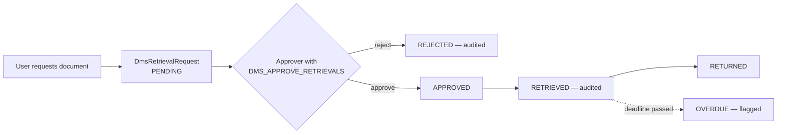

**Supporting controls:**

| Control | Model |
|---|---|
| Check-in / check-out | `checkedOut`, `checkedOutById`, `checkedOutAt`, `checkoutNotes` |
| Version history | `DmsVersion` — prior versions retained, never overwritten |
| Soft delete | `DmsRecycleBinItem` — recoverable, with an audit trail |
| Time-boxed external sharing | `DmsShareLink`, `DocumentShareLink` |
| Approval chains | `ApprovalTemplate` / `ApprovalStep` / `ApprovalRequest` — five approver-resolution methods |
| Policy gates | `BusinessRule` — JSONLogic conditions gating `DOCUMENT_SIGN`, with recorded overrides |

**`BusinessRuleOverride` records who bypassed a control and why.** Overrides are captured as
evidence, not silently permitted — which is exactly what an auditor looks for.

---

## Data residency and sovereignty

**The architectural claim:** all customer data resides on one VM and one block device in a region
the customer chooses. There is no vendor-side copy.

| Data | Location | Leaves the tenancy? |
|---|---|---|
| Documents | Postgres volume, or the customer's own bucket | **No** |
| Audit trail | Postgres volume | **No** |
| Identity | Postgres volume | **No** |
| Signing key | Host file or the customer's HSM | **No** |
| Backups | Customer's object storage, customer's region | **No** |
| Email notification content | To the configured SMTP provider | **Yes — by design, disclose it** |
| OCR content | To the configured OCR endpoint | **Yes if the endpoint is external — host it internally to avoid this** |
| Teams notifications | To Microsoft | **Yes if enabled** |

**Three integrations move data across the boundary. Each is optional and independently disablable.**

For a strict-residency deployment: in-region SMTP relay, OCR service on the private network,
Teams disabled. **Then nothing leaves.**

---

## Data subject requests (GDPR / privacy)

| Right | How it is served | Status |
|---|---|---|
| **Access** | Query by `userId` across `User`, `Session`, audit logs, `Recipient`, `DmsDocument` | Scripted extract |
| **Portability** | Documents export as signed PDFs; metadata as JSON | Supported |
| **Rectification** | Profile editing; audit history is immutable **by design and by law** | Supported |
| **Erasure** | `onDelete: Cascade` removes sessions, passkeys, tokens, security logs | ⚠️ **See conflict below** |
| **Restriction** | Deactivate account; `RETAINED` disposal status on records | Supported |
| **Objection** | Notification preferences; webhook disablement | Supported |

⚠️ **The erasure conflict — address it directly, do not hide it.**

`DocumentAuditLog` deliberately denormalises signer name and email so signing evidence survives
account deletion. **This is a genuine tension between the right to erasure and the legal
requirement to retain signing evidence.** Under GDPR Art. 17(3)(b)/(e), retention for legal
claims is a recognised lawful basis. **The customer must record this in their retention policy
and privacy notice.** It is a policy decision for them, enabled by our data model — and stating
it up front is more credible than being asked.

---

## Compliance mapping

| Framework | What HubSign provides | What the customer provides |
|---|---|---|
| **SOC 2** — Security | RBAC, MFA, audit logs, encryption, session controls | Cloud IAM, monitoring, IR process, vendor management |
| **SOC 2** — Confidentiality | Classification, field encryption, permission model | Key custody, access reviews, DLP |
| **SOC 2** — Availability | Health checks, restart policies, stateless app | Backup schedule, DR testing, SLA |
| **ISO 27001** A.8 | Asset classification, ownership, retention & disposal | Asset register, policy |
| **ISO 27001** A.9 | RBAC, least privilege, 12 discrete DMS rights | Access review cadence |
| **ISO 27001** A.12.4 | Three audit ledgers, IP/UA capture | Log shipping, retention, review |
| **GDPR** Art. 5, 25, 30, 32, 17 | Retention model, self-host by design, data map, encryption, cascade delete | DPIA, records of processing, lawful basis |
| **eIDAS / ESIGN / UETA** | Signer authentication, intent capture, audit certificate, PKI seal | Legal review in-jurisdiction |
| **Records management** | File plan, retention schedule, disposal approval, legal hold | Retention schedule content |

**Positioning line:** HubSign supplies the **technical controls and the evidence**. Certification
is achieved by the customer's organisation, with HubSign as an auditable component of scope.

---

# 7. Operations

---

## Backup and disaster recovery

**Three layers, because they fail differently.**

| Layer | Method | Cadence | Retention | Recovers from |
|---|---|---|---|---|
| **Logical** | `pg_dump -Fc` → encrypted object storage | Nightly + pre-upgrade | 30 daily / 12 monthly | Corruption, bad migration, accidental deletion |
| **Volume** | Cloud disk snapshot | 6-hourly | 7 days | Host loss, disk failure |
| **Configuration** | Compose + env in git; secrets in the secret store | On change | Full history | Misconfiguration, rebuild from zero |

```bash
# Nightly logical backup — encrypted before it leaves the host
docker exec hubsign-database pg_dump -U postgres -Fc documenso \
  | age -r "$BACKUP_PUBKEY" \
  > /backup/hubsign-$(date +%F).dump.age
```

**Recovery objectives on the single-instance model:**

| Scenario | RPO | RTO |
|---|---|---|
| Container failure | 0 | < 2 min (restart policy) |
| Host failure, snapshot restore | ≤ 6 h | 30–60 min |
| Region loss, cross-region copy | ≤ 24 h | 2–4 h |
| Logical corruption, `pg_dump` restore | ≤ 24 h | 1–2 h |

⚠️ **Back up the encryption keys and the signing certificate separately, in the secret store.**
A database restore without them yields unreadable encrypted fields. **Test the restore quarterly —
an untested backup is a hypothesis, not a control.**

---

## Observability

| Signal | Source | Where it goes |
|---|---|---|
| Application logs | Container stdout | CloudWatch / Log Analytics / DO Monitoring |
| Database health | `pg_isready` healthcheck | Compose restart policy |
| Host metrics | Cloud agent | Cloud-native monitoring |
| Error tracking | Honeybadger (`NEXT_PRIVATE_LOGGER_HONEY_BADGER_API_KEY`) | Optional, external |
| Product analytics | PostHog (`NEXT_PUBLIC_POSTHOG_KEY`) | Optional — **omit for strict residency** |
| Background jobs | `BackgroundJob` / `BackgroundJobTask` tables | Queryable in-app |
| Webhook delivery | `WebhookCall` — status, response code, bodies | Queryable in-app |

**Alerts that matter on this architecture:**

1. **Data volume > 80%** — the leading indicator on this model, especially with `database` transport
2. Container restart loop — usually a failed migration
3. `SIGN_IN_FAIL` rate spike — credential stuffing
4. Webhook failure rate — broken downstream integration
5. Certificate expiry — TLS **and** the PKCS#12 signing certificate

---

## Upgrade and rollback

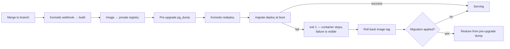

**Rules the team should internalise:**

- **Always `pg_dump` before an upgrade that carries migrations.** Prisma migrations are forward-only
- **Pin image tags in production.** `:latest` makes rollback ambiguous — use immutable tags
- **A failed migration stops the container.** That is intentional: visible failure beats silent corruption
- **Rolling back the image does not roll back the schema.** If a migration applied, restore the dump

---

## Deployment checklist

Run this before every customer go-live. **No item is optional.**

**Secrets**
- [ ] `NEXTAUTH_SECRET` regenerated (not the repository default)
- [ ] Both encryption keys regenerated, **different from each other**, stored in KMS/Key Vault
- [ ] Database password regenerated
- [ ] Signing certificate generated, passphrase set, stored in the secret store

**Network**
- [ ] VM in a private subnet, no public IP
- [ ] Database port **not** published to a public interface
- [ ] Load balancer TLS 1.2+, HTTP→HTTPS redirect, HSTS
- [ ] **WAF rate limiting configured** — the application has none
- [ ] **Security headers set at the edge** — CSP, `X-Frame-Options`, `X-Content-Type-Options`
- [ ] Egress restricted to known destinations
- [ ] SSH not reachable from the internet

**Configuration**
- [ ] `NEXT_PUBLIC_WEBAPP_URL` = the public HTTPS URL (build-time — verify before building)
- [ ] `NEXT_PRIVATE_OIDC_SKIP_VERIFY` unset or `false`
- [ ] `NEXT_PRIVATE_SMTP_UNSAFE_IGNORE_TLS` **unset**
- [ ] Upload transport chosen deliberately and sized
- [ ] `NEXT_PUBLIC_DISABLE_SIGNUP=true` for closed deployments

**Data**
- [ ] Data volume on a dedicated encrypted block device with a customer-managed key
- [ ] Snapshot schedule active; `pg_dump` job scheduled and **verified by a test restore**
- [ ] Encryption keys and signing certificate backed up **separately** from the database
- [ ] Retention schedule configured in the DMS; disposal approvers named

---

# 8. Summary

---

## What we are asking the technical team to take away

| Question they will ask | Our answer |
|---|---|
| *Is it portable?* | Four generic primitives — VM, disk, load balancer, secret store. Runs unchanged on all three clouds |
| *Where does the data live?* | One VM, one encrypted volume, one region the customer picks. Three optional integrations cross that line; each can be turned off |
| *Is it secure by default?* | Strong at the application layer — MFA, passkeys, per-document auth, field encryption, PKI sealing. **Rate limiting and security headers must be supplied at the edge.** That is on the checklist |
| *Can we prove what happened?* | Three append-only ledgers, plus an audit certificate sealed inside every completed PDF that validates in Adobe without us |
| *What breaks first?* | The disk. Watch database size — it is the leading indicator on this model |
| *What if we outgrow it?* | Two environment variables move you to managed Postgres and object storage. Nothing assumes the database is local |
| *What are you not telling us?* | The hardening backlog slide. Eight open items, all edge-mitigated or scoped, none a blocker for a correctly configured deployment |

---

## Recommended next steps

1. **Pick the reference cloud** for the first customer deployment — AWS if there is a KMS mandate,
   Azure for Microsoft-aligned enterprises, DigitalOcean for pilots
2. **Close the two edge-dependent gaps in the application** — rate limiting and security headers —
   so correctness stops depending on the load balancer being configured right
3. **Add `/api/health`** with a database probe, so load balancers health-check meaningfully
4. **Re-enable encryption-key startup validation** and remove the default secrets from the committed compose file
5. **Rehearse the restore** — quarterly, on a real snapshot, including keys and signing certificate
6. **Document the encryption-key rotation procedure** and run it once in a non-production environment

---

# Appendix

---

## Environment variables that matter most

| Variable | Purpose | Failure mode if wrong |
|---|---|---|
| `NEXT_PUBLIC_WEBAPP_URL` | Public URL — **build-time inlined** | Broken signing links and OAuth callbacks |
| `NEXT_PRIVATE_DATABASE_URL` | Postgres connection | No start |
| `NEXTAUTH_SECRET` | Session signing | Sessions forgeable if default |
| `NEXT_PRIVATE_ENCRYPTION_KEY` | Primary field encryption | **Unrecoverable data loss if lost** |
| `NEXT_PRIVATE_ENCRYPTION_SECONDARY_KEY` | Time-limited payloads | Expiring links break |
| `NEXT_PRIVATE_SIGNING_TRANSPORT` | `local` \| `gcloud-hsm` | Sealing fails |
| `NEXT_PRIVATE_SIGNING_LOCAL_FILE_CONTENTS` | base64 PKCS#12 | Sealing fails |
| `NEXT_PRIVATE_SIGNING_PASSPHRASE` | Certificate passphrase | Sealing fails |
| `NEXT_PUBLIC_UPLOAD_TRANSPORT` | `database` \| `s3` | Uploads fail, or disk fills |
| `NEXT_PRIVATE_SMTP_*` / `RESEND` / `MAILCHANNELS` | Notification delivery | Signers never notified |
| `NEXT_PRIVATE_INBOUND_EMAIL_SECRET` | Signature Inbox auth | **Unauthenticated inbound if unset** |
| `NEXT_PRIVATE_CRON_SECRET` | Scheduled job auth | **Unauthenticated job triggers if unset** |
| `NEXT_PRIVATE_OIDC_SKIP_VERIFY` | **Must be false** | IdP verification disabled |
| `NEXT_PUBLIC_DISABLE_SIGNUP` | Close registration | Open self-registration |

---

## Operator command reference

```bash
# ── Status ────────────────────────────────────────────────────────────────
docker compose ps
docker compose logs -f hubsign --tail 200

# ── Database ──────────────────────────────────────────────────────────────
docker exec -it hubsign-database psql -U postgres -d documenso
docker exec hubsign-database psql -U postgres -d documenso \
  -c "SELECT pg_size_pretty(pg_database_size('documenso'));"      # watch this

# ── Backup ────────────────────────────────────────────────────────────────
docker exec hubsign-database pg_dump -U postgres -Fc documenso > backup.dump

# ── Restore ───────────────────────────────────────────────────────────────
docker exec -i hubsign-database pg_restore -U postgres -d documenso --clean < backup.dump

# ── Migration state ───────────────────────────────────────────────────────
docker exec hubsign npx prisma migrate status --schema ./packages/prisma/schema.prisma

# ── Secret generation ─────────────────────────────────────────────────────
openssl rand -base64 32                                            # each secret, separately

# ── Signing certificate ───────────────────────────────────────────────────
openssl req -x509 -newkey rsa:4096 -keyout key.pem -out cert.pem -days 730
openssl pkcs12 -export -out cert.p12 -inkey key.pem -in cert.pem
base64 -w0 cert.p12                                                # → secret store
```

---

## References in the repository

| Topic | Path |
|---|---|
| Application Dockerfile | `Dockerfile` |
| Boot script | `docker/start.sh` |
| Production compose | `docker/production/compose.yml` |
| Docs compose + Komodo notes | `docker/production/docs.compose.yml`, `docs/DEPLOYMENT_DOCS.md` |
| Configuration surface | `.env.example` |
| Schema | `packages/prisma/schema.prisma` |
| Authentication | `packages/auth/server/` |
| Encryption | `packages/lib/universal/crypto.ts` |
| Signing transports | `packages/signing/` |
| Audit log types | `packages/lib/types/document-audit-logs.ts` |
| Document auth model | `packages/lib/types/document-auth.ts` |
| Organization spec | `docs/ORGANIZATION_SPEC.md` |
| User manual | `docs/USER_MANUAL.md` |

---

# Questions

**HubSign** — your documents, your cloud, your keys, your audit trail.
